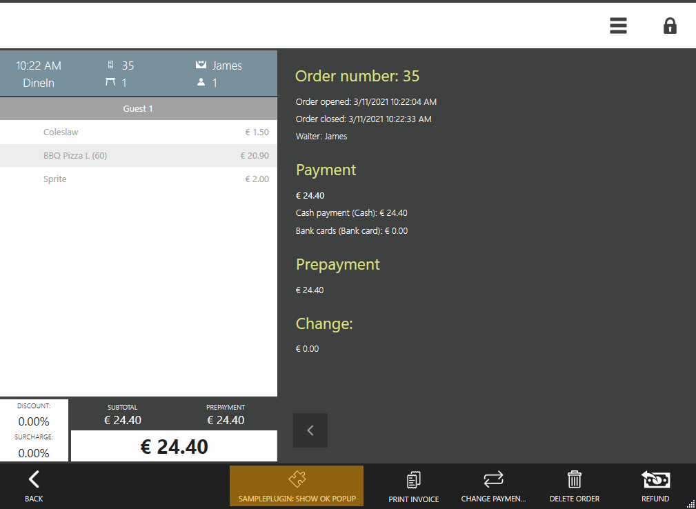
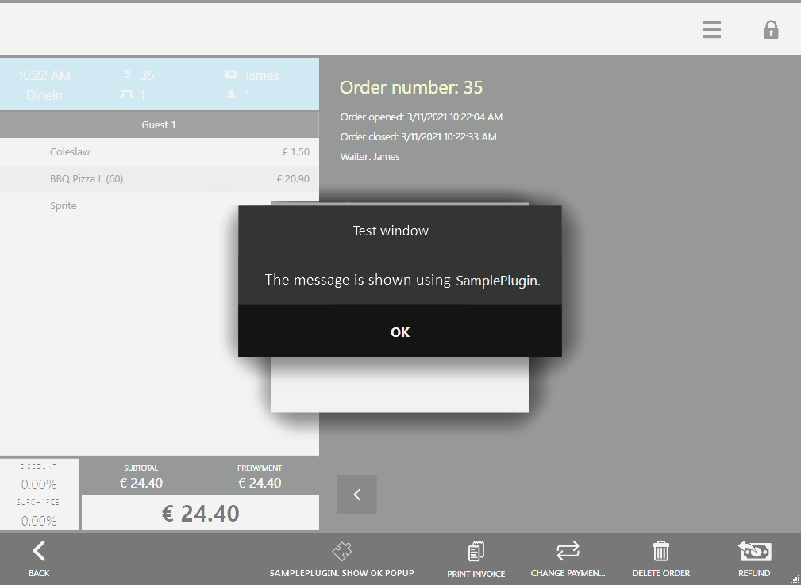
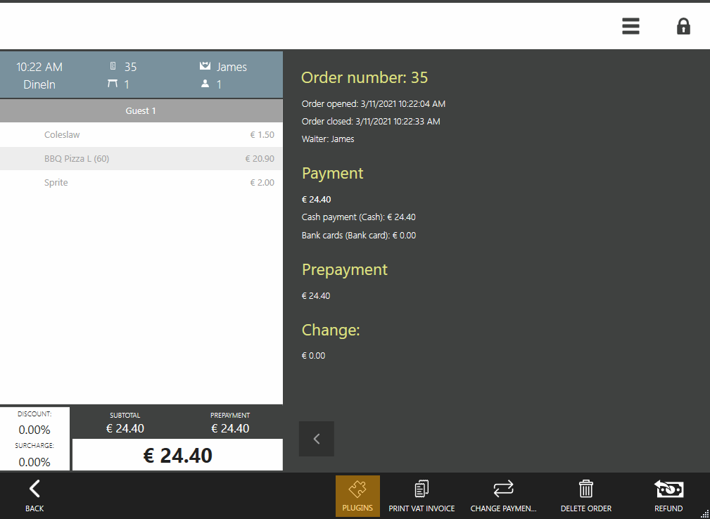
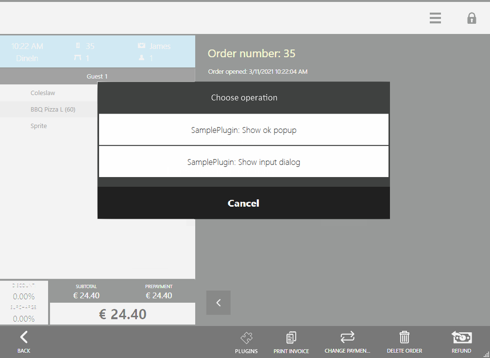
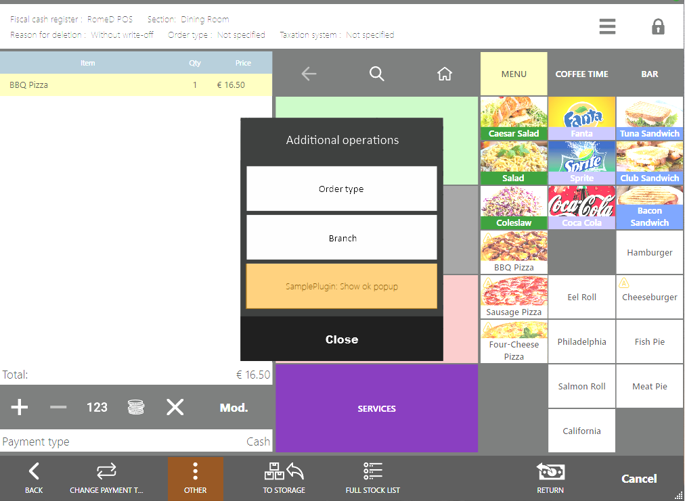

# Customizing Closed Order Screen #

The closed order screen (current till shift) and the product return screen can have custom commands added to run operations using a closed order object.

## How it works in Syrve POS?

### 1. Closed order screen under the current till shift

This is how the *«SamplePlugin: Show OK popup»*, button added by the SDK SamplePlugin looks like.

 


Suppose the plugin shows the following message (check the [*API Dialogs*](ViewManager.html "API Dialogs") articles).

 

The plugin can add more than one button to the closed order screen at a time.


For example, 2 buttons are added using the SamplePlugin SDK: *«SamplePlugin: Show OK popup»* и *«SamplePlugin: Show input dialog»*. In this case, the *Plugins* button will appear on the closed order screen.

 

The *Plugins* button will also appear on the screen if several plugins add one button each on the closed order screen.

If pressed, the *Plugins* menu will show a list of all available buttons.

 


### 2. Product return screen (closed order under the past till shift)

Check the [documentation ](https://en.syrve.help/articles/#!syrve-pos-8-5/product-return) for the product return against the receipt (past till shift orders).

 

## Adding Custom Plugins

##### Step 1. Register a processor for a required closed order screen type:
 
```cs
subscriptions = new CompositeDisposable
{
	// Registration of the action on the closed order screen under the current till shift
	Integration.AddButtonOnClosedOrderView("SamplePlugin: Show ok popup", ShowOkPopupOnClosedOrderScreen),
	
	// Registration of the action on the closed order screen under the past till shift
	Integration.AddButtonOnPastOrderView("SamplePlugin: Show ok popup", ShowOkPopupOnPastOrderScreen),
};
``` 

The operation registration function receives the following 2 arguments on the **current** till shift screen [`AddButtonOnClosedOrderView()`](https://syrve.github.io/front.api.sdk/v6/html/M_Resto_Front_Api_Extensions_PluginIntegrationServiceExtensions_AddButtonOnClosedOrderView.htm) принимает на вход 2 аргумента:

- `string` — button name is given in the UI.
- `Action<IOrder, ICashRegisterInfo, IViewManager>` — a function that is invoked if the button is pressed.

The operation registration function on the **past** till shift screen [`AddButtonOnPastOrderView()`](https://syrve.github.io/front.api.sdk/v6/html/M_Resto_Front_Api_Extensions_PluginIntegrationServiceExtensions_AddButtonOnPastOrderView.htm).
Syrve POS does not store orders of **closed** till shifts, therefore [`AddButtonOnPastOrderView()`](https://syrve.github.io/front.api.sdk/v6/html/M_Resto_Front_Api_Extensions_PluginIntegrationServiceExtensions_AddButtonOnPastOrderView.htm).

Syrve POS does not store orders of closed till shifts, therefore, [`IOrder`](https://syrve.github.io/front.api.sdk/v6/html/T_Resto_Front_Api_Data_Orders_IOrder.htm) cannot be obtained by the order ID in the [`AddButtonOnPastOrderView()`](https://syrve.github.io/front.api.sdk/v6/html/M_Resto_Front_Api_Extensions_PluginIntegrationServiceExtensions_AddButtonOnPastOrderView.htm) method. A past till shift order ID can only be useful to the plugin or an external service if it maintains its own storage.

##### Step 2. Provide the button processor description:

```cs
private void ShowOkPopupOnClosedOrderScreen(IOrder closedOrder, ICashRegisterInfo cashRegister, IViewManager viewManager)
{
	viewManager.ShowOkPopup(“Text box", “The text is given using SamplePlugin");
}
```

```cs
private void ShowOkPopupOnPastOrderScreen(Guid pastOrderId, ICashRegisterInfo cashRegister, IViewManager viewManager)
{
	viewManager.ShowOkPopup(“Text box", “The text is given using SamplePlugin");
}
```
 
You can check implementation examples in the SamplePlugin SDK project, class `ButtonsTester`.