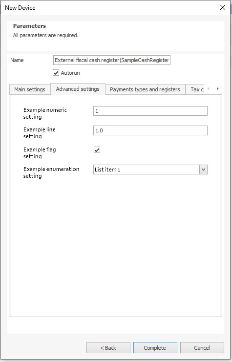
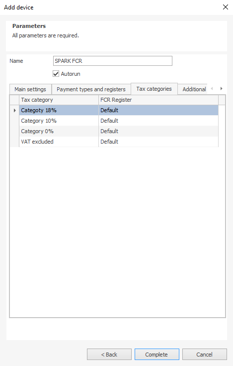
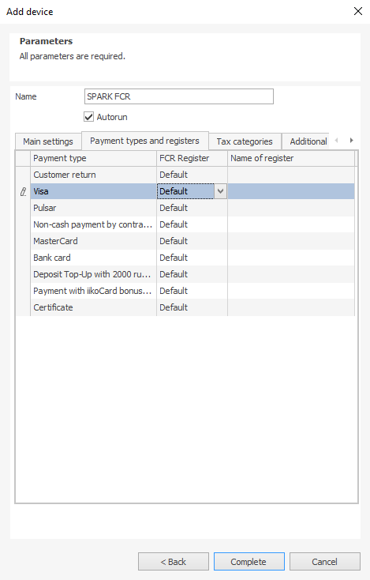
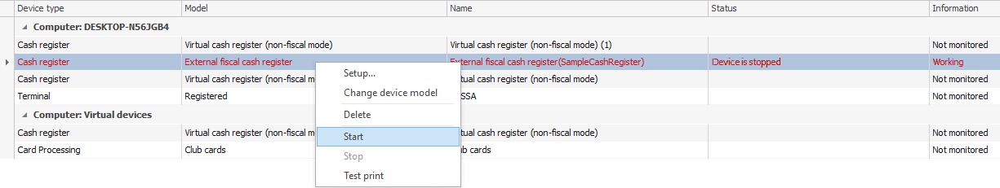
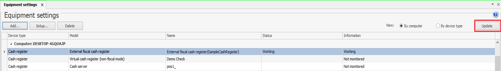
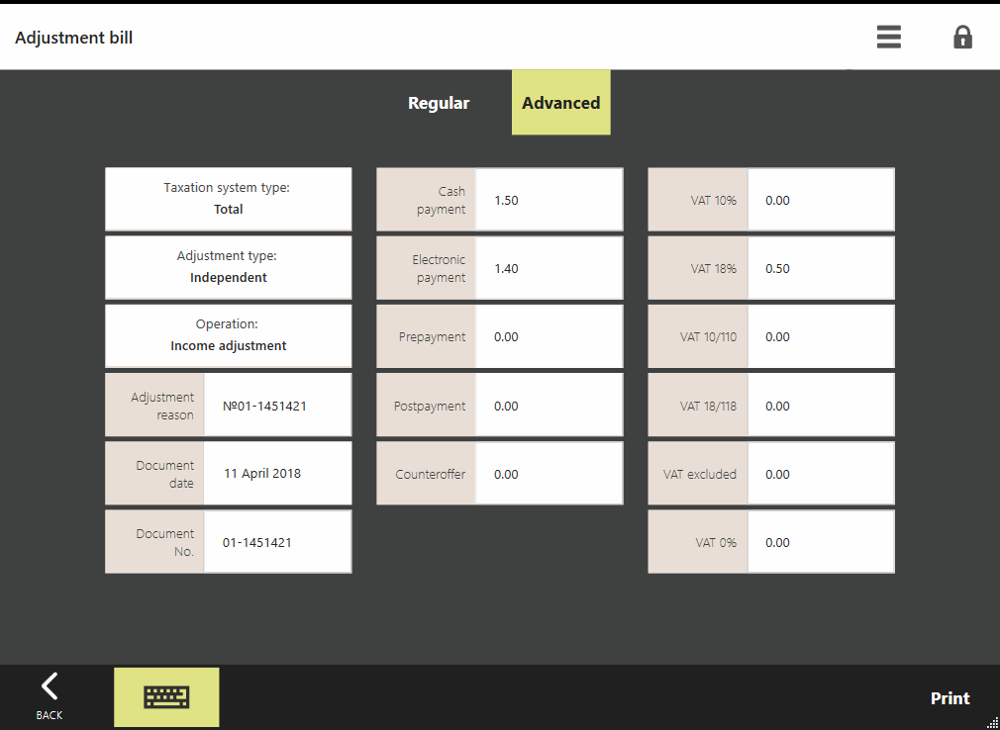
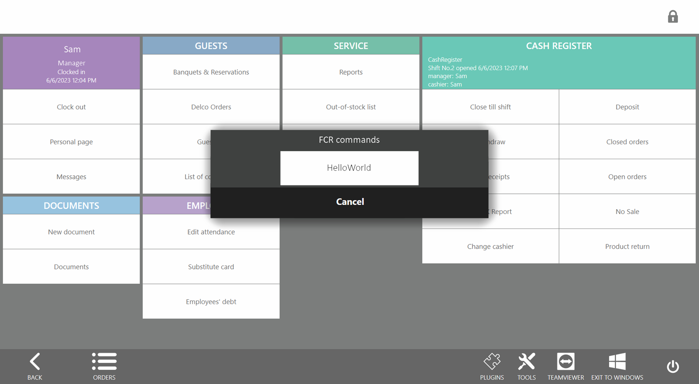
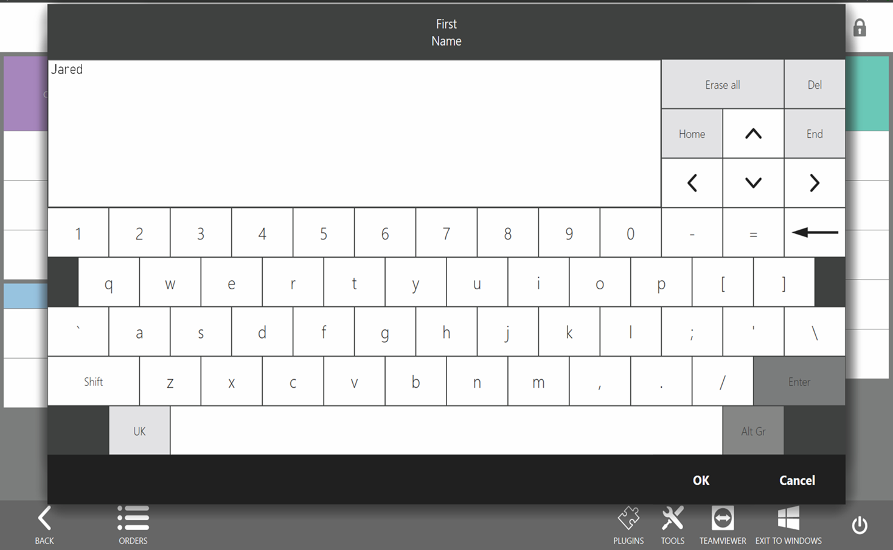
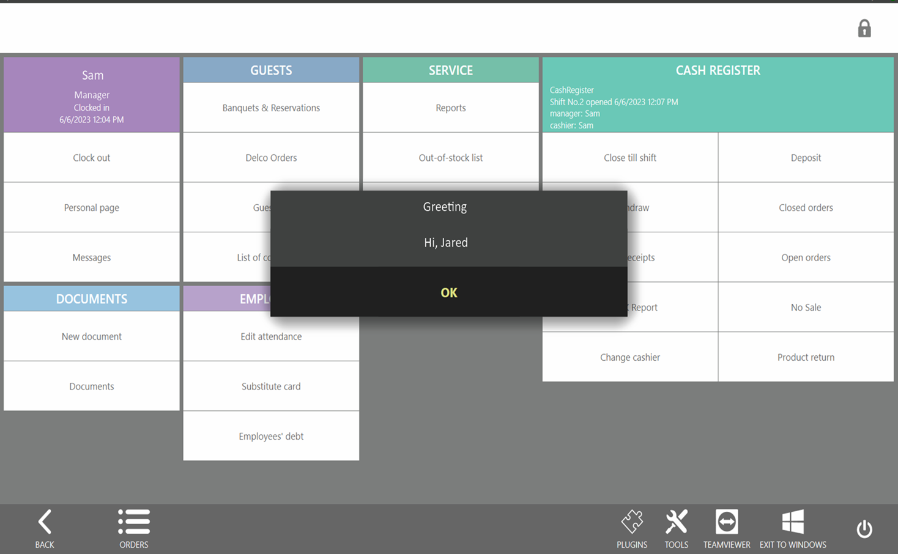

f you can’t find the right model on the list of Syrve supported fiscal registers (FCR), you can write your own plugin. This plugin will be connected to Syrve POS and considered as an external FCR. See the [Introduction]({{ site.baseurl }}/v6/en/Devices.html) article. External FCR plugins must be [licensed]({{ site.baseurl }}/v6/en/Licensing.html).

## Setting Up
You can set up an external FCR in 2 steps.

**Step 1:** Register a new FCR model. For this, you need to implement the [`ICashRegisterFactory`](https://syrve.github.io/front.api.sdk/v6/html/T_Resto_Front_Api_Devices_ICashRegisterFactory.htm) interface and register it by calling API methods:

```cs
var cashRegisterFactory = new SampleCashRegisterFactory();
PluginContext.Operations.RegisterCashRegisterFactory(cashRegisterFactory)
```
You need this to make your new FCR model visible in Syrve RMS so you can then add it and set up as cash register equipment on your POS.


**Step 2:** Add a new FCR model. For this, you need to implement the [`ICashRegister`](https://syrve.github.io/front.api.sdk/v6/html/T_Resto_Front_Api_Devices_ICashRegister.htm) interface and add its instance to [`ICashRegisterFactory.Create()`](https://syrve.github.io/front.api.sdk/v6/html/M_Resto_Front_Api_Devices_ICashRegisterFactory_Create.htm):
```cs
class SampleCashRegisterFactory : MarshalByRefObject, ICashRegisterFactory
{
    ...
    public ICashRegister Create(Guid deviceId, [NotNull] CashRegisterSettings settings)
    {
        if (settings == null)
            throw new ArgumentNullException(nameof(settings));

        return new SampleCashRegister(deviceId, settings);
    }
}
```
By clicking «Complete» in the new device dialog (*Syrve Office > Equipment Settings*), you invoke [`ICashRegisterFactory.Create()`](https://syrve.github.io/front.api.sdk/v6/html/M_Resto_Front_Api_Devices_ICashRegisterFactory_Create.htm)which would add a new FCR to the list of equipment. After that, SyrveRMS can communicate with the external FCR—send commands and receive responses.


## Fiscal Register Settings
Each unit of equipment has its own set of settings ‒ [`IDeviceFactory.DefaultDeviceSettings`](https://syrve.github.io/front.api.sdk/v6/html/P_Resto_Front_Api_Devices_IDeviceFactory_DefaultDeviceSettings.htm):

```cs
interface IDeviceFactory
{
    ...
    [NotNull]
    DeviceSettings DefaultDeviceSettings { get; }
}
```

##### Custom Settings
Settings may vary depending on the FCR model. The [`DeviceSettings.Settings`](https://syrve.github.io/front.api.sdk/v6/html/T_Resto_Front_Api_Data_Device_Settings_DeviceSettings.htm) container is provided for this purpose:

```cs
class DeviceSettings
{
    ...
    List<DeviceSetting> Settings { get; set; }
}
```

###### Possible options:
- **bool** — checkbox — [`DeviceBooleanSetting`](https://syrve.github.io/front.api.sdk/v6/html/T_Resto_Front_Api_Data_Device_Settings_DeviceBooleanSetting.htm)
- **string** — text field — [`DeviceStringSetting`](https://syrve.github.io/front.api.sdk/v6/html/T_Resto_Front_Api_Data_Device_Settings_DeviceStringSetting.htm)
- **number** — numeric field [`DeviceNumberSetting`](https://syrve.github.io/front.api.sdk/v6/html/T_Resto_Front_Api_Data_Device_Settings_DeviceNumberSetting.htm): 
        — *integer* [`DeviceNumberSettingKind.Integer`](https://syrve.github.io/front.api.sdk/v6/html/T_Resto_Front_Api_Data_Device_Settings_DeviceNumberSettingKind.htm), 
        — *fractional* [`DeviceNumberSettingKind.Decimal`](https://syrve.github.io/front.api.sdk/v6/html/T_Resto_Front_Api_Data_Device_Settings_DeviceNumberSettingKind.htm), 
        — *quantitative, with control arrows* — [`DeviceNumberSettingKind.Amount`](https://syrve.github.io/front.api.sdk/v6/html/T_Resto_Front_Api_Data_Device_Settings_DeviceNumberSettingKind.htm)
- **enum** — list with a preconfigured value set [`DeviceCustomEnumSetting`](https://syrve.github.io/front.api.sdk/v6/html/T_Resto_Front_Api_Data_Device_Settings_DeviceCustomEnumSetting.htm):
        — *drop-down list* — [`DeviceCustomEnumSetting.IsList = true`](https://syrve.github.io/front.api.sdk/v6/html/P_Resto_Front_Api_Data_Device_Settings_DeviceCustomEnumSetting_IsList.htm)
        — *radio group* — [`DeviceCustomEnumSetting.IsList = false`](https://syrve.github.io/front.api.sdk/v6/html/P_Resto_Front_Api_Data_Device_Settings_DeviceCustomEnumSetting_IsList.htm)
        The list value is described by means of [`DeviceCustomEnumSettingValue`](https://syrve.github.io/front.api.sdk/v6/html/T_Resto_Front_Api_Data_Device_Settings_DeviceCustomEnumSettingValue.htm).  

When the FCR is connected, all the [`DeviceSettings.Settings`](https://syrve.github.io/front.api.sdk/v6/html/T_Resto_Front_Api_Data_Device_Settings_DeviceSettings.htm) collection settings will be given on *«Additional Settings»* tab:



##### Required Settings:
Certain settings are shared by all FCR models. Those are:
- [`CashRegisterSettings.Font0Width`](https://syrve.github.io/front.api.sdk/v6/html/P_Resto_Front_Api_Data_Device_Settings_CashRegisterSettings_Font0Width.htm) — receipt tape width (*«Main Settings tab»*).
- [`CashRegisterSettings.OfdProtocolVersion`](https://syrve.github.io/front.api.sdk/v6/html/P_Resto_Front_Api_Data_Device_Settings_CashRegisterSettings_OfdProtocolVersion.htm) — fiscal data format (FFD) protocol version (*«Main Settings tab»*).
- [`CashRegisterSettings.FiscalRegisterTaxItems`](https://syrve.github.io/front.api.sdk/v6/html/P_Resto_Front_Api_Data_Device_Settings_CashRegisterSettings_FiscalRegisterTaxItems.htm) —  list of FCR registers that correspond to tax categories (*«Tax Categories»* tab).



- [`CashRegisterSettings.FiscalRegisterTaxItems`](https://syrve.github.io/front.api.sdk/v6/html/P_Resto_Front_Api_Data_Device_Settings_CashRegisterSettings_FiscalRegisterPaymentItem.htm) — list of FCR registers that correspond to payment types (*«Payment Types and Register»* tab).



```cs
class CashRegisterSettings : DeviceSettings
{
    [CanBeNull]
    DeviceNumberSetting Font0Width;
    [CanBeNull]
    DeviceCustomEnumSetting OfdProtocolVersion;
    List<FiscalRegisterTaxItem> FiscalRegisterTaxItems;
    List<FiscalRegisterPaymentType> FiscalRegisterPaymentTypes;
}
```

# Syrve POS to External Fiscal Registers Interaction
Syrve POS communicates with External Fiscal Registers using the [`ICashRegister`](https://syrve.github.io/front.api.sdk/v6/html/T_Resto_Front_Api_Devices_ICashRegister.htm) interface. This interface is used to control external FCR operations. For instance, if an order is being paid in Syrve POS, the control will come in the [`ICashRegister.DoCheque()`](https://syrve.github.io/front.api.sdk/v6/html/M_Resto_Front_Api_Devices_ICashRegister_DoCheque.htm) command with the [`ChequeTask`](https://syrve.github.io/front.api.sdk/v6/html/T_Resto_Front_Api_Data_Device_Tasks_ChequeTask.htm) details required to perform the operation on the FCR. Syrve POS would standby until the command is executed and would analyze the FCR response ‒ [`CashRegisterResult`](https://syrve.github.io/front.api.sdk/v6/html/T_Resto_Front_Api_Data_Device_Results_CashRegisterResult.htm).

#### FCR Operations
**1.** [`Setup()`](https://syrve.github.io/front.api.sdk/v6/html/M_Resto_Front_Api_Devices_IDevice_Setup.htm) — FCR setup. This is the first command executed by the plugin. It is invoked when you add a new FCR or edit existing FCR settings. The primary plugin’s task is to save and apply new [`CashRegisterSettings`](https://syrve.github.io/front.api.sdk/v6/html/T_Resto_Front_Api_Data_Device_Settings_CashRegisterSettings.htm) settings that arrive as an argument. More often than not, this command stops the FCR driver, applies new settings, and starts the FCR if it has been running:

```cs
public void Setup([NotNull] DeviceSettings newSettings)
{
    if (newSettings == null)
        throw new ArgumentNullException(nameof(newSettings));

    Stop();
    Settings = (CashRegisterSettings)newSettings;
    if (newSettings.Autorun && wasConnected)
        Start();
}
```

**2.** [`Start()`](https://syrve.github.io/front.api.sdk/v6/html/M_Resto_Front_Api_Devices_IDevice_Start.htm) — FCR startup. The command is invoked by clicking «Start» in Syrve Office. The FCR can also start automatically if the «Start automatically» option is enabled in the FCR settings at the time the device is added.
 


Usually, this command initializes the driver, opens the port, connects to the device, and tests the connection:

```cs
public void Start()
{
    SetState(State.Starting);
    try
    {
        driver = new Driver(); // device driver initialization
        driver.Start()
    }
    catch (Exception e)
    {
        PluginContext.Log.Error($"Failed to load driver with error: {e.Message}");
        SetState(State.Stopped);
        throw new DeviceException(e.Message);
    }
    SetState(State.Running);
}
```
**3.** [`Stop()`](https://syrve.github.io/front.api.sdk/v6/html/M_Resto_Front_Api_Devices_IDevice_Stop.htm) — FCR stopping. The command is invoked by clicking Stop in Syrve Office. The command is used to stop the device, free up the resources, and close ports, for instance:

```cs
public void  Stop()
{
    SetState(State.Stopping);
    try
    {
        driver?.close();
    }
    catch (Exception e)
    {
        throw new DeviceException(e.Message);
    }
    driver = null;
    SetState(State.Stopped);
}
```
**4.** [`RemoveDevice()`](https://syrve.github.io/front.api.sdk/v6/html/M_Resto_Front_Api_Devices_IDevice_RemoveDevice.htm) — Deletion. The command is invoked if the Delete shortcut menu item is clicked on the external FCR device in Syrve Office. The FCR object will be marked as removed in the RMS if the command does not throw an exception.

**5.** [`GetDeviceInfo()`](https://syrve.github.io/front.api.sdk/v6/html/M_Resto_Front_Api_Devices_IDevice_GetDeviceInfo.htm) — FCR status request. The command is invoked each time the «Administration« > «Equipment Settings« menu item is selected or by clicking «Update« in the Equipment Settings window.



Depending on the [`DeviceInfo`](https://syrve.github.io/front.api.sdk/v6/html/T_Resto_Front_Api_Data_Device_Results_DeviceInfo.htm)response, the RMS reads the FCR communication protocol as follows: is the FCR operational and what commands can be sent to it. The FCR status is described by the [`DeviceInfo`](https://syrve.github.io/front.api.sdk/v6/html/T_Resto_Front_Api_Data_Device_Results_DeviceInfo.htm) type:
- [`State`](https://syrve.github.io/front.api.sdk/v6/html/P_Resto_Front_Api_Data_Device_Results_DeviceInfo_State.htm) — *FCR status*. It can be *«Running»*, *«Stopped»*, and so on.
- [`Comment`](https://syrve.github.io/front.api.sdk/v6/html/P_Resto_Front_Api_Data_Device_Results_DeviceInfo_Comment.htm) — *FCR status description*. 
- [`Settings`](https://syrve.github.io/front.api.sdk/v6/html/P_Resto_Front_Api_Data_Device_Results_DeviceInfo_Settings.htm) — *FCR settings* [`CashRegisterSettings`](https://syrve.github.io/front.api.sdk/v6/html/T_Resto_Front_Api_Data_Device_Settings_CashRegisterSettings.htm).

Example of the started and running device status request:

```cs
public DeviceInfo GetDeviceInfo()
{
    return new DeviceInfo
    {
        State = State.Running,
        Comment = “Running",
        Settings = currentCashRegisterSettings
    };
}
```

**6.** [`DoOpenSession()`](https://syrve.github.io/front.api.sdk/v6/html/M_Resto_Front_Api_Devices_ICashRegister_DoOpenSession.htm) — open till shift (TS). Applicable to the FCRs, drivers of which have the *«Open Shift»* command. If the FCR has no separate command to open a shift, a successful response [`CashRegisterResult.Success = true`](https://syrve.github.io/front.api.sdk/v6/html/T_Resto_Front_Api_Data_Device_Results_CashRegisterResult.htm) should be given without executing the operation in the FCR.

**7.** [`DoXReport()`](https://syrve.github.io/front.api.sdk/v6/html/M_Resto_Front_Api_Devices_ICashRegister_DoXReport.htm) — print an X Report or similar (interim daily report without closing a shift). An Syrve POS till shift is considered open, if the [`DoOpenSession()`](https://syrve.github.io/front.api.sdk/v6/html/M_Resto_Front_Api_Devices_ICashRegister_DoOpenSession.htm) command is executed without any exceptions, and [`DoXReport()`](https://syrve.github.io/front.api.sdk/v6/html/M_Resto_Front_Api_Devices_ICashRegister_DoXReport.htm) returns a successful result: [`CashRegisterResult.Success = true`](https://syrve.github.io/front.api.sdk/v6/html/T_Resto_Front_Api_Data_Device_Results_CashRegisterResult.htm).

**8.** [`DoBillCheque()`](https://syrve.github.io/front.api.sdk/v6/html/M_Resto_Front_Api_Devices_ICashRegister_DoBillCheque.htm) — guest bill or canceling guest bill. Executed if the FCR supports guest bill printing  [`CashRegisterDriverParameters.IsBillTaskSupported = true`](https://syrve.github.io/front.api.sdk/v6/html/T_Resto_Front_Api_Data_Device_Settings_CashRegisterDriverParameters.htm) (see [`«Invoice»`]({{ site.baseurl }}/2019/03/13/bill-chequetask-resolver.html) type receipt).

Order details arrive in the [`BillTask`](https://syrve.github.io/front.api.sdk/v6/html/T_Resto_Front_Api_Data_Device_Tasks_BillTask.htm) argument:
- [`Id`](https://syrve.github.io/front.api.sdk/v6/html/P_Resto_Front_Api_Data_Device_Tasks_CashRegisterTask_Id.htm) — operation unique number.
- [`CashierName`](https://syrve.github.io/front.api.sdk/v6/html/P_Resto_Front_Api_Data_Device_Tasks_CashRegisterTask_CashierName.htm) — cashier name.
- [`CashierId`](https://syrve.github.io/front.api.sdk/v6/html/P_Resto_Front_Api_Data_Device_Tasks_CashRegisterTask_CashierId.htm) — cashier GUID, their ID:

   ```cs
    IUser cashier = PluginContext.Operations.GetUserById(CashierId)
   ```
   
- [`CashierTaxpayerId`](https://syrve.github.io/front.api.sdk/v6/html/P_Resto_Front_Api_Data_Device_Tasks_CashRegisterTask_CashierTaxpayerId.htm) — cashier Tax ID.
- [`IsRefund`](https://syrve.github.io/front.api.sdk/v6/html/P_Resto_Front_Api_Data_Device_Tasks_BillTask_IsRefund.htm) — flag to signal that an operation is canceled. If «Refund» is selected in Syrve POS, the flag takes the `true` value, and the FCR must print a refund receipt.
- [`IsCancellation`](https://syrve.github.io/front.api.sdk/v6/html/P_Resto_Front_Api_Data_Device_Tasks_BillTask_IsCancellation.htm) — receipt voiding is only applicable in Belarus and Latvia. Voiding is the invalidation of incorrect sales receipts. If a cashier makes a refund, the FCR prints a refund receipt. If a cashier makes a mistake when posting receipts, a voiding receipt must be printed out.
- [`Sales`](https://syrve.github.io/front.api.sdk/v6/html/P_Resto_Front_Api_Data_Device_Tasks_BillTask_Sales.htm) — [`ChequeSale`](https://syrve.github.io/front.api.sdk/v6/html/T_Resto_Front_Api_Data_Device_Tasks_ChequeSale.htm) order items. Usually, those are order items details, sometimes grouped by VAT. This particularly depends on the FCR ‒ whether or not it supports FFD later than v.1.0.
- [`СancellingSaleNumber`](https://syrve.github.io/front.api.sdk/v6/html/P_Resto_Front_Api_Data_Device_Tasks_BillTask_СancellingSaleNumber.htm) — order number (applicable only in Belarus). It is filled up when the operation is canceled. There might be two operations: order guest bill and order payment. As the [`ChequeTask`](https://syrve.github.io/front.api.sdk/v6/html/T_Resto_Front_Api_Data_Device_Tasks_ChequeTask.htm) type (see order closing operation) includes the [`BillTask`](https://syrve.github.io/front.api.sdk/v6/html/T_Resto_Front_Api_Data_Device_Tasks_BillTask.htm) type, all current fields are related to the closing of orders as well.
- [`DiscountSum`](https://syrve.github.io/front.api.sdk/v6/html/P_Resto_Front_Api_Data_Device_Tasks_BillTask_DiscountSum.htm) — total discount amount. This includes only uncategorized discounts. Those are discounts that apply to the entire order rather than any individual item or category of items.
- [`IncreaseSum`](https://syrve.github.io/front.api.sdk/v6/html/P_Resto_Front_Api_Data_Device_Tasks_BillTask_IncreaseSum.htm) — total surcharge amount. This includes only surcharges that apply to the entire order.
- [`DiscountPercent`](https://syrve.github.io/front.api.sdk/v6/html/P_Resto_Front_Api_Data_Device_Tasks_BillTask_DiscountPercent.htm) — discount % on order amount. The discount or surcharge percentage here is given for reference only, so you don’t need to use them in your calculations, for instance, recalculate discounts.

```cs
DiscountPercent = (Order total / DiscountSum) * 100
```

- [`IncreasePercent`](https://syrve.github.io/front.api.sdk/v6/html/P_Resto_Front_Api_Data_Device_Tasks_BillTask_IncreasePercent.htm) — surcharge % order amount.

```cs
IncreasePercent = (Order total / IncreaseSum) * 100
```

- [`ResultSum`](https://syrve.github.io/front.api.sdk/v6/html/P_Resto_Front_Api_Data_Device_Tasks_BillTask_ResultSum.htm) — total order amount with all discounts and surcharges applied. This amount is the sum of all item prices including tax, discounts, surcharges, and rounding. It can be given in the following formula:

```cs
ResultSum = Order total - all discounts - rounding amount(RoundSum) + all surcharges
```

- [`TableNumberLocalized`](https://syrve.github.io/front.api.sdk/v6/html/P_Resto_Front_Api_Data_Device_Tasks_BillTask_TableNumberLocalized.htm) — formatted string with the table number. If FCR settings have the Print Order Number option enabled, then the string has the order number as well (for example, «Table: 10» or «Table: 10 Order: 5»).
- [`OrderNumber`](https://syrve.github.io/front.api.sdk/v6/html/P_Resto_Front_Api_Data_Device_Tasks_BillTask_OrderNumber.htm) — order number.
- [`TableNumber`](https://syrve.github.io/front.api.sdk/v6/html/P_Resto_Front_Api_Data_Device_Tasks_BillTask_TableNumber.htm) — table number.
- [`PrintArticle`](https://syrve.github.io/front.api.sdk/v6/html/P_Resto_Front_Api_Data_Device_Tasks_BillTask_PrintArticle.htm) — includes *«Print SKU On Receipt»* as the outlet group setting value (*«Administration» > «Outlet Settings» > «Group» > «Payment type setup»*).
- [`TextBeforeCheque`](https://syrve.github.io/front.api.sdk/v6/html/P_Resto_Front_Api_Data_Device_Tasks_BillTask_TextBeforeCheque.htm) — text at the top of the receipt. This functionality becomes available once the  [`IChequeTaskProcessor`](https://syrve.github.io/front.api.sdk/v6/html/T_Resto_Front_Api_Devices_ChequeTaskProcessor_IChequeTaskProcessor.htm) interface is implemented and registered using the [`RegisterChequeTaskProcessor()`](https://syrve.github.io/front.api.sdk/v6/html/M_Resto_Front_Api_IOperationService_RegisterChequeTaskProcessor.htm) command.
- [`TextAfterCheque`](https://syrve.github.io/front.api.sdk/v6/html/P_Resto_Front_Api_Data_Device_Tasks_BillTask_TextAfterCheque.htm) — text at the bottom of the receipt.

Order items are described through the [`ChequeSale`](https://syrve.github.io/front.api.sdk/v6/html/T_Resto_Front_Api_Data_Device_Tasks_ChequeSale.htm) type:
- [`Name`](https://syrve.github.io/front.api.sdk/v6/html/P_Resto_Front_Api_Data_Device_Tasks_ChequeSale_Name.htm) — item name (product, menu item, and so on).
- [`Code`](https://syrve.github.io/front.api.sdk/v6/html/P_Resto_Front_Api_Data_Device_Tasks_ChequeSale_Code.htm) — item SKU.  In some cases, an SKU may be missing (zero is used instead). For instance, a receipt with items grouped by VAT or prepayment receipt is printed out.
- [`Price`](https://syrve.github.io/front.api.sdk/v6/html/P_Resto_Front_Api_Data_Device_Tasks_ChequeSale_Price.htm) — item price before discounts and surcharges.
- [`Amount`](https://syrve.github.io/front.api.sdk/v6/html/P_Resto_Front_Api_Data_Device_Tasks_ChequeSale_Amount.htm) — item quantity.
- [`GuestName`](https://syrve.github.io/front.api.sdk/v6/html/P_Resto_Front_Api_Data_Device_Tasks_ChequeSale_GuestName.htm) — name of quest who ordered an item.
- [`Vat`](https://syrve.github.io/front.api.sdk/v6/html/P_Resto_Front_Api_Data_Device_Tasks_ChequeSale_Vat.htm) — item VAT amount.
- [`Section`](https://syrve.github.io/front.api.sdk/v6/html/P_Resto_Front_Api_Data_Device_Tasks_ChequeSale_Section.htm) —  section of the fiscal register to which an item belongs according to the general preparation chart (*«Administration» > «Outlet Settings» > «Group» > «General Settings» > «General Preparation Chart»*).
- [`DiscountSum`](https://syrve.github.io/front.api.sdk/v6/html/P_Resto_Front_Api_Data_Device_Tasks_ChequeSale_DiscountSum.htm) — amount of category discounts applicable to the item.
- [`IncreaseSum`](https://syrve.github.io/front.api.sdk/v6/html/P_Resto_Front_Api_Data_Device_Tasks_ChequeSale_IncreaseSum.htm) — amount of category surcharges applicable to the item.
- [`Discount`](https://syrve.github.io/front.api.sdk/v6/html/P_Resto_Front_Api_Data_Device_Tasks_ChequeSale_Discount.htm) — item discount percentage.

```cs
Discount = (Item price / DiscountSum) * 100
```

- [`Increase`](https://syrve.github.io/front.api.sdk/v6/html/P_Resto_Front_Api_Data_Device_Tasks_ChequeSale_Increase.htm) — item surcharge percentage.

```cs
Increase = (Item price / IncreaseSum) * 100
```

- [`Sum`](https://syrve.github.io/front.api.sdk/v6/html/P_Resto_Front_Api_Data_Device_Tasks_ChequeSale_Sum.htm) — both item and entire order total price after all discounts and surcharges (categorial and non-categorial).

```cs
Sum = item price ‒ all applicable discounts + all surcharges
```

- [`IsTaxable`](https://syrve.github.io/front.api.sdk/v6/html/P_Resto_Front_Api_Data_Device_Tasks_ChequeSale_IsTaxable.htm) — whether or not an item is subject to tax (tax category is verified).
- [`TaxId`](https://syrve.github.io/front.api.sdk/v6/html/P_Resto_Front_Api_Data_Device_Tasks_ChequeSale_TaxId.htm) — FCR tax rate ID according to the tax category an item falls into (*«Administration» > «Equipment Settings» > «FCR Settings» > «Tax Categories»*). If Syrve tax categories are matched against FCR tax categories, the tax rate ID specified by the user is transferred. If tax categories are not matched («Default» value is used), the null string is transferred.
- [`TransferType`](https://syrve.github.io/front.api.sdk/v6/html/P_Resto_Front_Api_Data_Device_Tasks_ChequeSale_TransferType.htm) — payment method flag (advance payment (*«Advance»*), payment (*«FullPayment»*), and so on).
- [`ItemCategory`](https://syrve.github.io/front.api.sdk/v6/html/P_Resto_Front_Api_Data_Device_Tasks_ChequeSale_ItemCategory.htm) — payment attribute flag code that matches an item according to the *«Inventory Management» > «Payment Attributes database»*.
- [`Contractor`](https://syrve.github.io/front.api.sdk/v6/html/P_Resto_Front_Api_Data_Device_Tasks_ChequeSale_Contractor.htm) — supplier. A supplier is specified in the *«General Preparation Chart»* table of the group settings (*«Administration» > «Outlet Settings» > «Group» > «General Settings» > «General Preparation Chart»*).
- [`GtinCode`](https://syrve.github.io/front.api.sdk/v6/html/P_Resto_Front_Api_Data_Device_Tasks_ChequeSale_GtinCode.htm) — 14-character Global Trade Item Number of a receipt item.
- [`ProductId`](https://syrve.github.io/front.api.sdk/v6/html/P_Resto_Front_Api_Data_Device_Tasks_ChequeSale_ProductId.htm) — identifier of an item, product, service, or any other unit. To get a menu item:

```cs
PluginContext.Operations.GetProductById(chequeTask.Sales[0].ProductId)
```

Once the Guest Bill button is tapped on the order screen, the terminal sends a command to the FCR and waits for the response [`CashRegisterResult`](https://syrve.github.io/front.api.sdk/v6/html/T_Resto_Front_Api_Data_Device_Results_CashRegisterResult.htm) which includes:
- [`Success`](https://syrve.github.io/front.api.sdk/v6/html/P_Resto_Front_Api_Data_Device_Results_PostResult_Success.htm) — `true` — operation completed successfully, `false` — operation failed or an error occurred.
- [`Message`](https://syrve.github.io/front.api.sdk/v6/html/P_Resto_Front_Api_Data_Device_Results_PostResult_Message.htm) — text message on the FCR command execution. This text is displayed on the POS screen if the operation succeeds.
- [`CashSum`](https://syrve.github.io/front.api.sdk/v6/html/P_Resto_Front_Api_Data_Device_Results_CashRegisterResult_CashSum.htm) — cash on hand as of the time of request.
- [`TotalIncomeSum`](https://syrve.github.io/front.api.sdk/v6/html/P_Resto_Front_Api_Data_Device_Results_CashRegisterResult_TotalIncomeSum.htm) — total receipts (cash + non-cash) in the cash register for the current till shift.

```cs
TotalIncomeSum = sales amount ‒ refund amount
```

Once the till shift is closed or opened, [`TotalIncomeSum`](https://syrve.github.io/front.api.sdk/v6/html/P_Resto_Front_Api_Data_Device_Results_CashRegisterResult_TotalIncomeSum.htm) must be zero.
- [`Session`](https://syrve.github.io/front.api.sdk/v6/html/P_Resto_Front_Api_Data_Device_Results_CashRegisterResult_Session.htm) — FCR shift number.
- [`SerialNumber`](https://syrve.github.io/front.api.sdk/v6/html/P_Resto_Front_Api_Data_Device_Results_CashRegisterResult_SerialNumber.htm) — FCR serial number.
- [`DocumentNumber`](https://syrve.github.io/front.api.sdk/v6/html/P_Resto_Front_Api_Data_Device_Results_CashRegisterResult_DocumentNumber.htm) — document number (till shift opening, deposits, withdrawals, and others are documents).
- [`SaleNumber`](https://syrve.github.io/front.api.sdk/v6/html/P_Resto_Front_Api_Data_Device_Results_CashRegisterResult_SaleNumber.htm) — receipt number (receipt: sales receipt, refund receipt).
- [`BillNumber`](https://syrve.github.io/front.api.sdk/v6/html/P_Resto_Front_Api_Data_Device_Results_CashRegisterResult_BillNumber.htm) — order/bill number (applicable in Belarus).
- [`RtcDateTime `](https://syrve.github.io/front.api.sdk/v6/html/P_Resto_Front_Api_Data_Device_Results_CashRegisterResult_RtcDateTime.htm) — FCR date and time.

This is how a response to the majority of FCR commands looks like, whether it is the payment, prepayment, guest bill, Z report printing, X report printing, deposit, or withdrawal. Depending on the response contents, Syrve POS tells whether an FCR command is executed or not and what is the result. In the general case, if an operation that receives such a response is unsuccessful ([`Success`](https://syrve.github.io/front.api.sdk/v6/html/P_Resto_Front_Api_Data_Device_Results_PostResult_Success.htm)=*false*), Syrve POS would display an error message on the screen ([`Message`](https://syrve.github.io/front.api.sdk/v6/html/P_Resto_Front_Api_Data_Device_Results_PostResult_Message.htm)) and consider the FCR command as failed. This does not apply to the doubling check carried out each time a monetary operation (payment, refund, deposit, withdrawal, prepayment) takes place. This procedure is aimed to prevent duplicate monetary transactions in case the FCR returns an error. Prior to each such operation, Syrve POS would match FCR amounts against internal calculations to identify any discrepancies. 

Negative results are processed equally by Syrve POS, whereas positive results are analyzed case by case. Thus, in the case of a guest bill, an order/bill number will be saved in the Syrve POS database provided [`BillNumber`](https://syrve.github.io/front.api.sdk/v6/html/P_Resto_Front_Api_Data_Device_Results_CashRegisterResult_BillNumber.htm) != *null*.

**9.** [`DoCheque()`](https://syrve.github.io/front.api.sdk/v6/html/M_Resto_Front_Api_Devices_ICashRegister_DoCheque.htm) — order closing, prepayment, refund. The command is invoked when an order is being closed (Pay tapped on the cash register screen) in Syrve POS. All the required order information, like payments and cashier details, arrives within the [`ChequeTask`](https://syrve.github.io/front.api.sdk/v6/html/T_Resto_Front_Api_Data_Device_Tasks_ChequeTask.htm)argument which includes the [`BillTask`](https://syrve.github.io/front.api.sdk/v6/html/T_Resto_Front_Api_Data_Device_Tasks_BillTask.htm) description and adds the following parameters:
- [`CashPayment`](https://syrve.github.io/front.api.sdk/v6/html/P_Resto_Front_Api_Data_Device_Tasks_ChequeTask_CashPayment.htm) — cash sales amount.
- [`CardPayments`](https://syrve.github.io/front.api.sdk/v6/html/P_Resto_Front_Api_Data_Device_Tasks_ChequeTask_CardPayments.htm) — cashless sales amount. The [`ChequeCardPayment`](https://syrve.github.io/front.api.sdk/v6/html/T_Resto_Front_Api_Data_Device_Tasks_ChequeCardPayment.htm) cashless payment contains:
   — payment amount [`ChequeCardPayment.Name`](https://syrve.github.io/front.api.sdk/v6/html/P_Resto_Front_Api_Data_Device_Tasks_ChequeCardPayment_Name.htm), 
   — FCR register corresponding to the payment type [`ChequeCardPayment.PaymentRegisterId`](https://syrve.github.io/front.api.sdk/v6/html/P_Resto_Front_Api_Data_Device_Tasks_ChequeCardPayment_PaymentRegisterId.htm),
   — default flag if the FCR register is not assigned [`ChequeCardPayment.IsDefaultNonCash`](https://syrve.github.io/front.api.sdk/v6/html/P_Resto_Front_Api_Data_Device_Tasks_ChequeCardPayment_IsDefaultNonCash.htm).
- [`CreditSum`](https://syrve.github.io/front.api.sdk/v6/html/P_Resto_Front_Api_Data_Device_Tasks_ChequeTask_CreditSum.htm) — post-payment receipt amount (credit).
- [`ConsiderationSum`](https://syrve.github.io/front.api.sdk/v6/html/P_Resto_Front_Api_Data_Device_Tasks_ChequeTask_ConsiderationSum.htm) — consideration receipt amount.
- [`PrepaymentSum`](https://syrve.github.io/front.api.sdk/v6/html/P_Resto_Front_Api_Data_Device_Tasks_ChequeTask_PrepaymentSum.htm) — prepayment receipt amount (advance payment and/or previous payments).

All the above-mentioned payment types put together cover the order price.

- [`RoundSum`](https://syrve.github.io/front.api.sdk/v6/html/P_Resto_Front_Api_Data_Device_Tasks_ChequeTask_RoundSum.htm) — amount of round-off in the customer’s favor. If, for example, an order price is € 20.05, the  [`RoundSum`](https://syrve.github.io/front.api.sdk/v6/html/P_Resto_Front_Api_Data_Device_Tasks_ChequeTask_RoundSum.htm) amount is 5 cents. Rounding amounts are not included in order or item discounts; they are given only in the current field.
- [`OrderId`](https://syrve.github.io/front.api.sdk/v6/html/P_Resto_Front_Api_Data_Device_Tasks_ChequeTask_OrderId.htm) — order identifier. To get the order:

    ```cs
    PluginContext.Operations.GetOrderById(chequeTask.OrderId.Value)
    ```
	
- [`PrepaymentId`](https://syrve.github.io/front.api.sdk/v7/html/P_Resto_Front_Api_Data_Device_Tasks_ChequeTask_PrepaymentId.htm) — payment GUID which makes it possible to clearly identify the refunded receipt. Used for all prepayment operations and is required to link prepayments with refunds; any other operation returns null. The plugin may keep its own local operation database registering prepayment operations details. Therefore, when prepayments are refunded, the plugin would identify the prepayment operation and use, for example, unique refund IDs.
- [`BillNumber`](https://syrve.github.io/front.api.sdk/v6/html/P_Resto_Front_Api_Data_Device_Tasks_ChequeTask_BillNumber.htm) — receipt fiscal number.
- [`OperationTime`](https://syrve.github.io/front.api.sdk/v6/html/P_Resto_Front_Api_Data_Device_Tasks_ChequeTask_OperationTime.htm) — order closing time.
- [`IsOfdElectronicChequeOnly`](https://syrve.github.io/front.api.sdk/v6/html/P_Resto_Front_Api_Data_Device_Tasks_ChequeTask_ChequeTask_IsOfdElectronicChequeOnly.htm) — receipt printing only; no SMS or any other notifications.
- [`OfdPhoneNumber`](https://syrve.github.io/front.api.sdk/v6/html/P_Resto_Front_Api_Data_Device_Tasks_ChequeTask_OfdPhoneNumber.htm) — OFD phone number to receive a receipt copy.
- [`OfdEmail`](https://syrve.github.io/front.api.sdk/v6/html/P_Resto_Front_Api_Data_Device_Tasks_ChequeTask_OfdEmail.htm) — OFD email to receive a receipt copy.
- [`TaxationSystem`](https://syrve.github.io/front.api.sdk/v6/html/P_Resto_Front_Api_Data_Device_Tasks_ChequeTask_TaxationSystem.htm) — receipt taxation system.
- [`SettlementAddress`](https://syrve.github.io/front.api.sdk/v6/html/P_Resto_Front_Api_Data_Device_Tasks_ChequeTask_SettlementAddress.htm) — payment address. It depends on the FCR settings made in *«Administration» > «Equipment Settings» > «FCR Settings» > «Additional Information»*.
- [`SettlementPlace`](https://syrve.github.io/front.api.sdk/v6/html/P_Resto_Front_Api_Data_Device_Tasks_ChequeTask_SettlementPlace.htm) — payment place. It depends on the FCR settings made in *«Administration» > «Equipment» Settings» > «FCR Settings» > «Additional Information»*.

If so configured, Syrve POS matches till shift financial calculations with the FCR calculations when processing payments, prepayments, refunds, deposits, and withdrawals; by default, this verification is enabled. This helps avoid repeated receipt printing that may actually take place even if the result is unsuccessful ‒ [`Success`](https://syrve.github.io/front.api.sdk/v6/html/P_Resto_Front_Api_Data_Device_Results_PostResult_Success.htm)=*false*. For this, the [`CashSum`](https://syrve.github.io/front.api.sdk/v6/html/P_Resto_Front_Api_Data_Device_Results_CashRegisterResult_CashSum.htm) and [`TotalIncomeSum`](https://syrve.github.io/front.api.sdk/v6/html/P_Resto_Front_Api_Data_Device_Results_CashRegisterResult_TotalIncomeSum.htm) fields are analyzed. Also, once the payment is made, Syrve POS saves the FCR [`DocumentNumber`](https://syrve.github.io/front.api.sdk/v6/html/P_Resto_Front_Api_Data_Device_Results_CashRegisterResult_DocumentNumber.htm) in the database; you can then see this number and the [`SaleNumber`](https://syrve.github.io/front.api.sdk/v6/html/P_Resto_Front_Api_Data_Device_Results_CashRegisterResult_SaleNumber.htm) in the closed order detail

[`DoCheque()`](https://syrve.github.io/front.api.sdk/v6/html/M_Resto_Front_Api_Devices_ICashRegister_DoCheque.htm) implementation example:

```cs
public CashRegisterResult DoCheque([NotNull] ChequeTask chequeTask)
{
	if (chequeTask == null)
		throw new ArgumentNullException(nameof(chequeTask));

	if (chequeTask.IsCancellation)
		throw new DeviceException("Cancellation receipts are not supported");

	driver.SetCashier(chequeTask.CashierName, chequeTask.CashierTaxpayerId);

	//Canceling open documents if any
	driver.ResetDevice();
	
	//Opening receipt
	if (chequeTask.isRefund)
		driver.OpenRefundCheck();
	else
		driver.OpenSaleCheck()

	//printing table and order number
	driver.PrintText(string.IsNullOrWhiteSpace(chequeTask.TableNumberLocalized)
		? string.Format("Стол: {0}, Заказ № {1}", chequeTask.TableNumber, chequeTask.OrderNumber)
		: chequeTask.TableNumberLocalized);

	//Printing additional strings at the top of receipt
	if (!string.IsNullOrWhiteSpace(chequeTask.TextBeforeCheque))
		driver.PrintText(chequeTask.TextBeforeCheque);

	foreach (var sale in chequeTask.Sales)
	{
		var taxId = GetTaxId(sale); //retrieving tax rate
		driver.RegisterItem(sale.Name, sale.Price, sale.Amount, taxId);

		//Registering item discount
		if (sale.DiscountSum > 0.0m)
			driver.RegisterDiscount(sale.DiscountSum)
		
		//Registering item surcharge
		if (sale.IncreaseSum > 0.0m)
			driver.RegisterIncrease(sale.IncreaseSum);
	}
	
	//Printing receipt subtotal
	driver.PrintSubtotal();
	
	//Registering receipt subtotal discount
	if (chequeTask.DiscountSum > 0.0m)
		driver.RegisterSubtotalDiscount(chequeTask.DiscountSum)

	//Registering receipt subtotal surcharge
	if (chequeTask.IncreaseSum > 0.0m)
		driver.RegisterSubtotalIncrease(chequeTask.IncreaseSum);

	foreach (var cardPayment in chequeTask.CardPayments)
	{
		var paymentRegisterId = GetPaymentRegisterId(cardPayment); //get payment type number
		driver.AddPayment(GetCardPaymentId(cardPayment), cardPayment.Sum);
	}

	cardPayments = chequeTask.CardPayments.Sum(cardPament=>cardPayment.Sum);
	
	if (chequeTask.CashPayment > 0.0m || cardPayments == 0.0m)
	{
		//cashPaymentId – cash payment type number
		driver.AddPayment(cashPaymentId, cardPayment.Sum);
	}

	//Printing additional strings at the bottom of receipt
	if (!string.IsNullOrWhiteSpace(chequeTask.TextAfterCheque))
		driver.PrintText(chequeTask.TextAfterCheque);

	//Closing receipt
	driver.CloseCheck();
	return GetCashRegisterData();
}
```

**10.** [`GetCashRegisterData()`](https://syrve.github.io/front.api.sdk/v6/html/M_Resto_Front_Api_Devices_ICashRegister_GetCashRegisterData.htm) —  FCR data request command. It is invoked each time a fiscal operation takes place to retrieve money amounts details, FCR serial number (if it changed within one TS, Syrve POS would ask to close it and open a new one), or the FCR date and time at the shift opening to reconcile the data.

[`GetCashRegisterData()`](https://syrve.github.io/front.api.sdk/v6/html/M_Resto_Front_Api_Devices_ICashRegister_GetCashRegisterData.htm) implementation example:

```cs
public CashRegisterResult GetCashRegisterData()
{
	CheckState(State.Running);
	var totalIncomeSum = driver.GetSalesSum() - driver.GetRefundsSum();
	var cashSum = driver.GetCashSum();
	var serialNumber = driver.GetSerialNumber();
	var sessionNumber = driver.GetSessionNumber();
	var dateTime = driver.GetDateTime();
	var receiptNumber = driver.GetLastReceiptNumber();
	var documentNumber = driver.GetLastDocumentNumber();

	return new CashRegisterResult(cashSum, totalIncomeSum, sessionNumber, serialNumber, receiptNumber, 
								  documentNumber, null, dateTime.ToString(CultureInfo.InvariantCulture));
}
```

**11.** [`GetCashRegisterStatus()`](https://syrve.github.io/front.api.sdk/v6/html/M_Resto_Front_Api_Devices_ICashRegister_GetCashRegisterStatus.htm) — FCR status request command. This status is given in the Syrve POS status bar. If, for example, the FCR returns the [`RestaurantMode`](https://syrve.github.io/front.api.sdk/v6/html/P_Resto_Front_Api_Data_Device_Results_CashRegisterStatus_RestaurantMode.htm) service mode and it does not correspond to the Syrve POS service mode, a warning will be given: «Invalid FCR mode». 
[`SessionStatus`](https://syrve.github.io/front.api.sdk/v6/html/P_Resto_Front_Api_Data_Device_Results_CashRegisterStatus_SessionStatus.htm) is used to check if the shift is overdue or not. Besides, an FCR may display a message in the status bar if:

```cs
    status.Success = false && status.Message != null
```

Syrve POS interrogates the FCR status each time a fiscal operation takes place.

**12.** [`OpenDrawer()`](https://syrve.github.io/front.api.sdk/v6/html/M_Resto_Front_Api_Devices_ICashRegister_OpenDrawer.htm) — open cash drawer. Depending on the «Open Cash Drawer» payment type settings, an FCR will be sent a command to open the drawer.

**13.** [`IsDrawerOpened()`](https://syrve.github.io/front.api.sdk/v6/html/M_Resto_Front_Api_Devices_ICashRegister_IsDrawerOpened.htm) — whether or not a cash drawer is open. If an FCR does not support a cash drawer status retrieval command, `true` needs to be returned

**14.** [`PrintText()`](https://syrve.github.io/front.api.sdk/v6/html/M_Resto_Front_Api_Devices_ICashRegister_PrintText.htm) —  printing of non-fiscal documents. For instance, reports or item barcodes. The document text will be sent to the [`PrintText()`](https://syrve.github.io/front.api.sdk/v6/html/M_Resto_Front_Api_Devices_ICashRegister_PrintText.htm) command to print it out on paper.

**15.** [`DoPayIn()`](https://syrve.github.io/front.api.sdk/v6/html/M_Resto_Front_Api_Devices_ICashRegister_DoPayIn.htm) — depositing money to the cash register. Cashier details can be retrieved the following way:

```cs
IUser cashier = PluginContext.Operations.GetUserById(cashierId)
```

**16.** [`DoPayOut()`](https://syrve.github.io/front.api.sdk/v6/html/M_Resto_Front_Api_Devices_ICashRegister_DoPayOut.htm) — withdrawing money from the cash register.

**17.** [`DoCorrection()`](https://syrve.github.io/front.api.sdk/v6/html/M_Resto_Front_Api_Devices_ICashRegister_DoCorrection.htm) — adjustment bill printing.
 


Based on the [`CorrectionTask`](https://syrve.github.io/front.api.sdk/v6/html/T_Resto_Front_Api_Data_Device_Tasks_CorrectionTask.htm) object, an FCR can tell which adjustment bill should be posted:
- [`DocumentType`](https://syrve.github.io/front.api.sdk/v6/html/P_Resto_Front_Api_Data_Device_Tasks_CorrectionTask_DocumentType.htm) — payment indicator: 
    — [`CorrectionDocumentType.Sale`](https://syrve.github.io/front.api.sdk/v6/html/T_Resto_Front_Api_Data_Device_Tasks_CorrectionDocumentType.htm) — receipts adjustment,
    — [`CorrectionDocumentType.Buy`](https://syrve.github.io/front.api.sdk/v6/html/T_Resto_Front_Api_Data_Device_Tasks_CorrectionDocumentType.htm) — expenses adjustment.
- [`CorrectionReason`](https://syrve.github.io/front.api.sdk/v6/html/P_Resto_Front_Api_Data_Device_Tasks_CorrectionTask_CorrectionReason.htm) — adjustment type:
    — [`CorrectionReasonEnum.OwnInitiative`](https://syrve.github.io/front.api.sdk/v6/html/T_Resto_Front_Api_Data_Device_Tasks_CorrectionReasonEnum.htm) — self-initiated,
    — [`CorrectionReasonEnum.Determination`](https://syrve.github.io/front.api.sdk/v6/html/T_Resto_Front_Api_Data_Device_Tasks_CorrectionReasonEnum.htm) — by instruction.
- [`CashSum`](https://syrve.github.io/front.api.sdk/v6/html/P_Resto_Front_Api_Data_Device_Tasks_CorrectionTask_CashSum.htm) — receipt amount in cash.
- [`NonCashSum`](https://syrve.github.io/front.api.sdk/v6/html/P_Resto_Front_Api_Data_Device_Tasks_CorrectionTask_NonCashSum.htm) — electronic money.
- [`PrepaymentSum`](https://syrve.github.io/front.api.sdk/v6/html/P_Resto_Front_Api_Data_Device_Tasks_CorrectionTask_PrepaymentSum.htm) — prepayment.
- [`CreditSum`](https://syrve.github.io/front.api.sdk/v6/html/P_Resto_Front_Api_Data_Device_Tasks_CorrectionTask_CreditSum.htm) — payment on credit.
- [`ConsiderationSum`](https://syrve.github.io/front.api.sdk/v6/html/P_Resto_Front_Api_Data_Device_Tasks_CorrectionTask_ConsiderationSum.htm) — consideration payment.
- [`DocumentDateTime`](https://syrve.github.io/front.api.sdk/v6/html/P_Resto_Front_Api_Data_Device_Tasks_CorrectionTask_DocumentDateTime.htm) — adjustment supporting document date in the YYYY-MM-DD format.
- [`DocumentNumber`](https://syrve.github.io/front.api.sdk/v6/html/P_Resto_Front_Api_Data_Device_Tasks_CorrectionTask_DocumentNumber.htm) — adjustment supporting document No.
- [`DocumentName`](https://syrve.github.io/front.api.sdk/v6/html/P_Resto_Front_Api_Data_Device_Tasks_CorrectionTask_DocumentName.htm) — adjustment supporting document name.
- [`TaxationSystem`](https://syrve.github.io/front.api.sdk/v6/html/P_Resto_Front_Api_Data_Device_Tasks_CorrectionTask_TaxationSystem.htm) — applicable taxation system.
- [`VatSum`](https://syrve.github.io/front.api.sdk/v6/html/P_Resto_Front_Api_Data_Device_Tasks_CorrectionTask_VatSum.htm) — VAT amounts to be adjusted (receipt VAT amounts at the rate of 18%, 10%, 18/118, 10/110, 0%, w/o VAT) [`CashRegisterVatData`](https://syrve.github.io/front.api.sdk/v6/html/T_Resto_Front_Api_Data_Device_Results_CashRegisterVatData.htm): [`TaxAmount`](https://syrve.github.io/front.api.sdk/v6/html/P_Resto_Front_Api_Data_Device_Results_CashRegisterVatData_TaxAmount.htm) — estimated VAT amount and [`TaxableSum`](https://syrve.github.io/front.api.sdk/v6/html/P_Resto_Front_Api_Data_Device_Results_CashRegisterVatData_TaxableSum.htm) — payment amount (for VAT 0 and w/o VAT).

**18.** [`DoZReport()`](https://syrve.github.io/front.api.sdk/v6/html/M_Resto_Front_Api_Devices_ICashRegister_DoZReport.htm) — close till shift on the FCR. An Syrve POS till shift is considered closed if the [`DoZReport()`](https://syrve.github.io/front.api.sdk/v6/html/M_Resto_Front_Api_Devices_ICashRegister_DoZReport.htm) command returns a successful result: [`CashRegisterResult.Success = true`](https://syrve.github.io/front.api.sdk/v6/html/T_Resto_Front_Api_Data_Device_Results_CashRegisterResult.htm).

**19.** [`GetQueryInfo()`](https://syrve.github.io/front.api.sdk/v6/html/M_Resto_Front_Api_Devices_ICashRegister_GetQueryInfo.htm) — request for FCR extended commands. Using the [`GetQueryInfo()`](https://syrve.github.io/front.api.sdk/v6/html/M_Resto_Front_Api_Devices_ICashRegister_GetQueryInfo.htm) and [`DirectIo()`](https://syrve.github.io/front.api.sdk/v6/html/M_Resto_Front_Api_Devices_ICashRegister_DirectIo.htm) commands, the FCR can add custom commands to be invoked from the Plugins section of Syrve POS. The [`GetQueryInfo()`](https://syrve.github.io/front.api.sdk/v6/html/M_Resto_Front_Api_Devices_ICashRegister_GetQueryInfo.htm)  method returns the description of custom FR commands, whereas [`DirectIo()`](https://syrve.github.io/front.api.sdk/v6/html/M_Resto_Front_Api_Devices_ICashRegister_DirectIo.htm) executes them. 

Customer greeting example:

```cs
public QueryInfoResult GetQueryInfo()
{
    var supportedCommands = new List<SupportedCommand>
    {
        // user greeting command with the "HelloWorld" codename
        new SupportedCommand("HelloWorld", "Greeting")
        {
            // input parameters
            Parameters = new List<RequiredParameter>
            {
                // username input field
                new RequiredParameter("UserName", "Username", "Enter username", "string")
            }
        }
    };

    var result = new QueryInfoResult
    {
        SupportedCommands = supportedCommands
    };

    return result;
}
```

```cs
public DirectIoResult DirectIo(CommandExecute command)
{
    if (command == null)
        throw new ArgumentNullException(nameof(command));

    var result = new DirectIoResult { Document = new Document { Lines = new List<string>() } };

    // retrieve user greeting command by the "HelloWorld" codename 
    if (command.Name == "HelloWorld")
    {
        // reading data from the username input parameter
        const string paramName = "UserName";
        var userName = command.Parameters.FirstOrDefault(item => item.Name == paramName)?.Value;
        
        // writing greeting message
        result.Message = userName != null ? $"Hi, {userName}!" : "Hello everybody!";
    }

    return result;
}
```

Selecting FCR commands:



Entering user name:



Customer greeting:



Therefore, the plugin may request certain customer details, show messages, display documents in the UI. [`QueryInfoResult`](https://syrve.github.io/front.api.sdk/v6/html/T_Resto_Front_Api_Data_Device_Results_QueryInfoResult.htm):
- [`SupportedCommands`](https://syrve.github.io/front.api.sdk/v6/html/P_Resto_Front_Api_Data_Device_Results_QueryInfoResult_SupportedCommands.htm) — list of supported extended FCR commands. [`SupportedCommand`](https://syrve.github.io/front.api.sdk/v6/html/T_Resto_Front_Api_Data_Device_Tasks_SupportedCommand.htm) includes:
    —  [`Name`](https://syrve.github.io/front.api.sdk/v6/html/P_Resto_Front_Api_Data_Device_Tasks_SupportedCommand_Name.htm) — command codename;
    —  [`ResourceName`](https://syrve.github.io/front.api.sdk/v6/html/P_Resto_Front_Api_Data_Device_Tasks_SupportedCommand_ResourceName.htm) — command display name;
    —  [`Parameters`](https://syrve.github.io/front.api.sdk/v6/html/P_Resto_Front_Api_Data_Device_Tasks_SupportedCommand_Parameters.htm) — data input field, where [`RequiredParameter.Type`](https://syrve.github.io/front.api.sdk/v6/html/P_Resto_Front_Api_Data_Device_Tasks_RequiredParameter_Type.htm) may be: `bool`, `string`, `int`, `datetime`, `double`. This determines the field input type: text, integer number input, fractional number input, flag, date input.
	
**20.** [`DirectIo()`](https://syrve.github.io/front.api.sdk/v6/html/M_Resto_Front_Api_Devices_ICashRegister_DirectIo.htm) — FR custom command execution. If the command returns [`DirectIoResult.Document`](https://syrve.github.io/front.api.sdk/v6/html/P_Resto_Front_Api_Data_Device_Results_DirectIoResult_Document.htm) filled up, this document will be displayed on the Syrve POS screen.

**21.** [`GetCashRegisterDriverParameters()`](https://syrve.github.io/front.api.sdk/v6/html/M_Resto_Front_Api_Devices_ICashRegister_GetCashRegisterDriverParameters.htm) — FCR driver settings.

Example:

```cs
public CashRegisterDriverParameters GetCashRegisterDriverParameters()
{
    return new CashRegisterDriverParameters
    {
        CanPrintText = true, \\ Whether or not FCR supports text printing
        SupportsPayInAfterSessionClose = true, \\ Whether or not FCR supports deposits in closed till shift
        CanPrintBarcode = true, \\ Whether or not FCR supports printing of simple barcodes
        CanPrintQRCode = true, \\ Whether or not FCR supports printing of QR codes
        CanUseFontSizes = true, \\ Whether or not FCR supports barcodes-to-text printing
        Font0Width = 44, \\ F0 font row width
        Font1Width = 42,\\ F1 font row width
        Font2Width = 22,\\ F2 font row width
        IsCancellationSupported = true, \\ Whether or not FCR supports Canceling operation        
		ZeroCashOnClose = false, \\ whether or not the FCR zeroes cash register balance out at the till shift closing
        IsBillTaskSupported = false, \\ Whether or not FCR supports printing guest bills via the Bill command
    };
}
```
Usually, such settings are received from the device driver once it is started as they are unknown before. These settings let Syrve POS know if the FCR can print text or not, deposit money in the closed till shift or not, supports printing of QR codes or not, and so on.

# FAQ
**1. Why an external FCR is not available on the list of devices?**

*Option 1*: It is likely that the external FCR is not registered properly. You can check this in *api.log* logs in the Syrve POS data folder. Availability of the following entries means that the external FCR has been successfully registered:

```cs
[2019-04-05 14:58:52,546] DEBUG [48] — Plugin “CashRegisterPluginFolderName” connected.
[2019-04-05 14:58:52,731] DEBUG [48] — Plugin “CashRegisterPluginFolderName” is calling RegisterCashRegisterFactory operation
[2019-04-05 14:58:52,791]  INFO [48] — Device factory: "CodeName" added.
```

*CashRegisterPluginFolderName* — folder name with the `.../Plugins/CashRegisterPluginFolderName` plugin, 
*CodeName* — [`DeviceSettings.CodeName`](https://syrve.github.io/front.api.sdk/v6/html/P_Resto_Front_Api_Devices_IDeviceFactory_CodeName.htm). Otherwise, logs would register an exception.

*Option 2*: Update the equipment settings page in Syrve Office: *«Administration»* > *«Equipment Settings»* > *«Update»*. If you open this tab before starting Syrve POS, the list of available models is not complete. Update the list or close it and open it again.

**2. How can I get a cashier name by Guid cashierId?**

```cs
IUser user = PluginContext.Operations.GetUserById(cashierId);
var name = user.Name;
```

**3. КHow to configure deposit and withdrawal types in Syrve Office to call FCR methods DoPayIn() and DoPayOut()?**

Most likely you have non-fiscal deposits and withdrawals configured. Those are just accounting movements that do not invoke FCR commands. Fiscal deposits and withdrawals must have an empty Chief Account. See Syrve[`user guides`](https://ru.iiko.help/smart/project-iikooffice/topic-102) on the types of deposits and withdrawals.