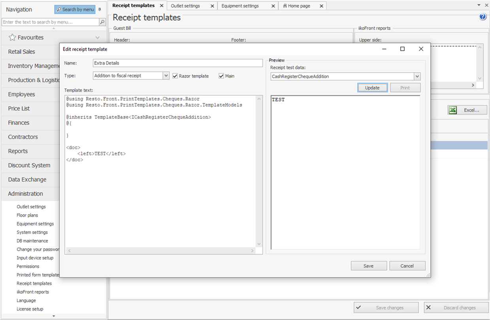

## Introduction
 
You can add any operations to the list of fiscal register commands. This may be required, for instance, if you need some operations to be carried out before or after the printing of receipts. It can be schematically displayed the following way:


If the plugin needs to take control while printing a payment or refund receipt or during the depositing, withdrawing, and printing X and Z reports, it’s enough to implement the  [`IChequeTaskProcessor`](https://syrve.github.io/front.api.sdk/v6/html/T_Resto_Front_Api_Devices_ChequeTaskProcessor_IChequeTaskProcessor.htm) interface and register it by invoking the [`RegisterChequeTaskProcessor()`](https://syrve.github.io/front.api.sdk/v6/html/M_Resto_Front_Api_IOperationService_RegisterChequeTaskProcessor.htm)  API method:

```cs
var chequeTaskProcessor = new ChequeTaskProcessor()
PluginContext.Operations.RegisterChequeTaskProcessor(chequeTaskProcessor);
```

All [`IChequeTaskProcessor`](https://syrve.github.io/front.api.sdk/v6/html/T_Resto_Front_Api_Devices_ChequeTaskProcessor_IChequeTaskProcessor.htm) interface commands can interrupt the main operation: receipt fiscalization, depositing, withdrawing, printing of X and Z reports. For this, you need to throw any type of exception in the command body. For instance, we add a condition forbidding virtual receipt printers (FCR) to close orders:

```cs
public BeforeDoCheckActionResult BeforeDoCheckAction(ChequeTask chequeTask, ICashRegisterInfo device, CashRegisterChequeExtensions chequeExtensions, IViewManager viewManager)
{
	// Example: allow printing payment and prepayment receipts only on physical devices.
	if (device.IsVirtual)
		throw new Exception("Cash register is virtual. Please close order on real device.");

	PluginContext.Log.InfoFormat("Before printing the receipt: {0} ({1})", device.FriendlyName, device.Id);
	
	...
}
```

When an order is paid on a virtual FCR, Syrve POS would display an error message and the order remains open:


You can find the [`IChequeTaskProcessor`](https://syrve.github.io/front.api.sdk/v6/html/T_Resto_Front_Api_Devices_ChequeTaskProcessor_IChequeTaskProcessor.htm) implementation and registration example in SDK SamplePlugin.


## Interface [`IChequeTaskProcessor`](https://syrve.github.io/front.api.sdk/v6/html/T_Resto_Front_Api_Devices_ChequeTaskProcessor_IChequeTaskProcessor.htm)

Let's take a closer look at [`IChequeTaskProcessor`](https://syrve.github.io/front.api.sdk/v6/html/T_Resto_Front_Api_Devices_ChequeTaskProcessor_IChequeTaskProcessor.htm) commands.


### 1. [`BeforeDoCheckAction`](https://syrve.github.io/front.api.sdk/v6/html/M_Resto_Front_Api_Devices_ChequeTaskProcessor_IChequeTaskProcessor_BeforeDoCheckAction.htm)

[`BeforeDoCheckAction()`](https://syrve.github.io/front.api.sdk/v6/html/M_Resto_Front_Api_Devices_ChequeTaskProcessor_IChequeTaskProcessor_BeforeDoCheckAction.htm) - a command executed before the receipt fiscalization. This may be the order closing, refund, guest bill printing, guest bill canceling, and product return. The main purpose of it is to check the operation availability and to add some extra details to a receipt.

##### How to add extra details to a receipt?

You can do it in two ways:
- By adding a receipt template in *«Syrve Office» > «Administration» > «Receipt templates» > «Add» > «Type: Addition to fiscal receipt»*. The template will be added at the bottom of receipt [`chequeTask.TextAfterCheque`](https://syrve.github.io/front.api.sdk/v6/html/P_Resto_Front_Api_Data_Device_Tasks_BillTask_TextAfterCheque.htm).
This is not a custom FCR function, so you don’t need to register [`IChequeTaskProcessor`](https://syrve.github.io/front.api.sdk/v6/html/T_Resto_Front_Api_Devices_ChequeTaskProcessor_IChequeTaskProcessor.htm).



- The plugin can add its values to [`chequeTask.TextBeforeCheque`](https://syrve.github.io/front.api.sdk/v6/html/P_Resto_Front_Api_Data_Device_Tasks_BillTask_TextBeforeCheque.htm), [`chequeTask.TextAfterCheque`](https://syrve.github.io/front.api.sdk/v6/html/P_Resto_Front_Api_Data_Device_Tasks_BillTask_TextAfterCheque.htm) and change a cashier name [`chequeTask.cashierName`](https://syrve.github.io/front.api.sdk/v6/html/P_Resto_Front_Api_Data_Device_Tasks_CashRegisterTask_CashierName.htm). This data will be sent to the FCR for printing. For this, you need to fill up corresponding fields in the resulting [`BeforeDoCheckActionResult`](https://syrve.github.io/front.api.sdk/v6/html/T_Resto_Front_Api_Data_Device_BeforeDoCheckActionResult.htm). value. If fields are not to be edited, return `null`.

```cs
public BeforeDoCheckActionResult BeforeDoCheckAction(ChequeTask chequeTask, ICashRegisterInfo device, CashRegisterChequeExtensions chequeExtensions, IViewManager viewManager)
{
 var beforeCheque = new List<Data.Print.Document>();
 var documentBefore = new Data.Print.Document();
 documentBefore.Markup.Add(new XElement(Tags.LargeFont, "Welcome"));
 documentBefore.Markup.Add(new XElement(Tags.SmallFont, "tel. 555-123456"));
 beforeCheque.Add(documentBefore);

 var afterCheque = new List<Data.Print.Document>();
 var documentAfter = new Data.Print.Document();
 documentBefore.Markup.Add(new XElement(Tags.SmallFont, "Thank you for shopping"));
 documentBefore.Markup.Add(new XElement(Tags.QRCode, "en.syrve.help"));
 beforeCheque.Add(documentAfter);
	
 return new BeforeDoCheckActionResult
 {
     BeforeCheque = beforeCheque,
     AfterCheque = afterCheque,
     CashierName = "CashierName"
 };
}
```

Arguments of the [`BeforeDoCheckAction()`](https://syrve.github.io/front.api.sdk/v6/html/M_Resto_Front_Api_Devices_ChequeTaskProcessor_IChequeTaskProcessor_BeforeDoCheckAction.htm) function:
- [`chequeTask`](https://syrve.github.io/front.api.sdk/v6/html/T_Resto_Front_Api_Data_Device_Tasks_ChequeTask.htm) — *order details*. All details on order items, discounts/surcharges, payments, and so on (check the [*External Fiscal Registers*](CashRegisters.html "External Fiscal Registers") article).
- [`device`](https://syrve.github.io/front.api.sdk/v6/html/T_Resto_Front_Api_Data_Device_ICashRegisterInfo.htm) — *information about the fiscal register used to close the order*.
- [`chequeExtensions`](https://syrve.github.io/front.api.sdk/v6/html/T_Resto_Front_Api_Data_Device_CashRegisterChequeExtensions.htm) — *receipt additional information*. Stores the markup to be added to the receipt top or bottom ([`chequeExtensions.BeforeCheque`](https://syrve.github.io/front.api.sdk/v6/html/P_Resto_Front_Api_Data_Device_CashRegisterChequeExtensions_BeforeCheque.htm), [`chequeExtensions.AfterCheque`](https://syrve.github.io/front.api.sdk/v6/html/P_Resto_Front_Api_Data_Device_CashRegisterChequeExtensions_AfterCheque.htm)). It also stores the [`chequeExtensions.PastOrderId`](https://syrve.github.io/front.api.sdk/v6/html/P_Resto_Front_Api_Data_Device_CashRegisterChequeExtensions_PastOrderId.htm) identifier and [`chequeExtensions.PastOrderNumber`](https://syrve.github.io/front.api.sdk/v6/html/P_Resto_Front_Api_Data_Device_CashRegisterChequeExtensions_PastOrderNumber.htm) number of the order closed within the previous till shift. These fields are filled up when past till shift orders are refunded.
- [`viewManager`](https://syrve.github.io/front.api.sdk/v6/html/T_Resto_Front_Api_UI_IViewManager.htm) — *window manager*.It allows displaying preset Syrve POS dialogs (check the [*Dialogs*](ViewManager.html "Dialogs")).


### 2. [`AfterDoCheckAction`](https://syrve.github.io/front.api.sdk/v6/html/M_Resto_Front_Api_Devices_ChequeTaskProcessor_IChequeTaskProcessor_AfterDoCheckAction.htm)

[`AfterDoCheckAction()`](https://syrve.github.io/front.api.sdk/v6/html/M_Resto_Front_Api_Devices_ChequeTaskProcessor_IChequeTaskProcessor_AfterDoCheckAction.htm) — кa command executed after the receipt fiscalization operation. The main purpose of it is to perform the final action after the printing of receipts. For instance, to queue the operation of export to the external system. The [`result`](https://syrve.github.io/front.api.sdk/v6/html/T_Resto_Front_Api_Data_Device_Results_PostResult.htm) argument describes an FCR operation result.
[`result.Success = true`](https://syrve.github.io/front.api.sdk/v6/html/P_Resto_Front_Api_Data_Device_Results_PostResult_Success.htm) — operation is successful, otherwise, it is not.
If the operation is not successful [`result.Success = false`](https://syrve.github.io/front.api.sdk/v6/html/P_Resto_Front_Api_Data_Device_Results_PostResult_Success.htm), the error description will be given in  [`result.Message`](https://syrve.github.io/front.api.sdk/v6/html/P_Resto_Front_Api_Data_Device_Results_PostResult_Message.htm).


### 3. [`BeforeXReport`](https://syrve.github.io/front.api.sdk/v6/html/M_Resto_Front_Api_Devices_ChequeTaskProcessor_IChequeTaskProcessor_BeforeXReport.htm)

[`BeforeXReport()`](https://syrve.github.io/front.api.sdk/v6/html/M_Resto_Front_Api_Devices_ChequeTaskProcessor_IChequeTaskProcessor_BeforeXReport.htm) — a command executed before printing an X Report. The following parameters are passed: a fiscal register that performs the operation, [`IViewManager`](https://syrve.github.io/front.api.sdk/v6/html/T_Resto_Front_Api_UI_IViewManager.htm "IViewManager")  to display messages or data input, and the  [`authUser`](https://syrve.github.io/front.api.sdk/v6/html/T_Resto_Front_Api_Data_Security_IUser.htm) user who initiated the printing of the X report. 


### 4. [`AfterXReport`](https://syrve.github.io/front.api.sdk/v6/html/M_Resto_Front_Api_Devices_ChequeTaskProcessor_IChequeTaskProcessor_AfterXReport.htm)

[`AfterXReport()`](https://syrve.github.io/front.api.sdk/v6/html/M_Resto_Front_Api_Devices_ChequeTaskProcessor_IChequeTaskProcessor_AfterXReport.htm) —  a command executed after printing an X Report. The arguments are similar to the [`AfterDoCheckAction`](https://syrve.github.io/front.api.sdk/v6/html/M_Resto_Front_Api_Devices_ChequeTaskProcessor_IChequeTaskProcessor_AfterDoCheckAction.htm) command.


### 5. [`BeforeZReport`](https://syrve.github.io/front.api.sdk/v6/html/M_Resto_Front_Api_Devices_ChequeTaskProcessor_IChequeTaskProcessor_BeforeZReport.htm)

[`BeforeZReport`](https://syrve.github.io/front.api.sdk/v6/html/M_Resto_Front_Api_Devices_ChequeTaskProcessor_IChequeTaskProcessor_BeforeZReport.htm) —  a command executed before printing a Z Report. Parameters pass the following data: FCR, user, and the [`IViewManager`](https://syrve.github.io/front.api.sdk/v6/html/T_Resto_Front_Api_UI_IViewManager.htm "IViewManager") window manager.


### 6. [`AfterPayIn`](https://syrve.github.io/front.api.sdk/v6/html/M_Resto_Front_Api_Devices_ChequeTaskProcessor_IChequeTaskProcessor_AfterPayIn.htm)

[`AfterPayIn`](https://syrve.github.io/front.api.sdk/v6/html/M_Resto_Front_Api_Devices_ChequeTaskProcessor_IChequeTaskProcessor_AfterPayIn.htm) — a command executed after depositing money to the cash register. The function receives the following data: FCR, FCR response during the deposit operation, the [`IViewManager`](https://syrve.github.io/front.api.sdk/v6/html/T_Resto_Front_Api_UI_IViewManager.htm "IViewManager") window manager, and the amount of money deposited to the cash register.


### 7. [`AfterPayOut`](https://syrve.github.io/front.api.sdk/v6/html/M_Resto_Front_Api_Devices_ChequeTaskProcessor_IChequeTaskProcessor_AfterPayOut.htm)

[`AfterPayOut`](https://syrve.github.io/front.api.sdk/v6/html/M_Resto_Front_Api_Devices_ChequeTaskProcessor_IChequeTaskProcessor_AfterPayOut.htm) — a command executed after withdrawing money from the cash register. The function receives the following data: FCR, FCR response during the withdrawal operation, the [`IViewManager`](https://syrve.github.io/front.api.sdk/v6/html/T_Resto_Front_Api_UI_IViewManager.htm "IViewManager") window manager, and the amount of money withdrawn from the cash register.


### Additional Interfaces [`IReadonlyChequeTaskProcessor`](https://syrve.github.io/front.api.sdk/v6/html/T_Resto_Front_Api_Devices_ChequeTaskProcessor_IReadonlyChequeTaskProcessor.htm) and [`IEditableChequeTaskProcessor`](https://syrve.github.io/front.api.sdk/v6/html/T_Resto_Front_Api_Devices_ChequeTaskProcessor_IEditableChequeTaskProcessor.htm)

Along with the [`IChequeTaskProcessor`](https://syrve.github.io/front.api.sdk/v6/html/T_Resto_Front_Api_Devices_ChequeTaskProcessor_IChequeTaskProcessor.htm) interface described above, there are [`IReadonlyChequeTaskProcessor`](https://syrve.github.io/front.api.sdk/v6/html/T_Resto_Front_Api_Devices_ChequeTaskProcessor_IReadonlyChequeTaskProcessor.htm) and [`IEditableChequeTaskProcessor`](https://syrve.github.io/front.api.sdk/v6/html/T_Resto_Front_Api_Devices_ChequeTaskProcessor_IEditableChequeTaskProcessor.htm), extending interfaces which allow completing specific tasks before depositing and withdrawing.


They are registered the same way as the parent interface. The difference between them is only that when using the [`IReadonlyChequeTaskProcessor`](https://syrve.github.io/front.api.sdk/v6/html/T_Resto_Front_Api_Devices_ChequeTaskProcessor_IReadonlyChequeTaskProcessor.htm) interface, the plugin, during the withdrawal, cannot edit the withdrawal amount, whereas the  [`IEditableChequeTaskProcessor`](https://syrve.github.io/front.api.sdk/v6/html/T_Resto_Front_Api_Devices_ChequeTaskProcessor_IEditableChequeTaskProcessor.htm) — interface can do it through the [`ref estimatedSum`](https://syrve.github.io/front.api.sdk/v6/html/M_Resto_Front_Api_Devices_ChequeTaskProcessor_IEditableChequeTaskProcessor_BeforePayOutSessionClosed.htm) parameter. This is implemented to let the plugin control withdrawal amounts at the end of the day.