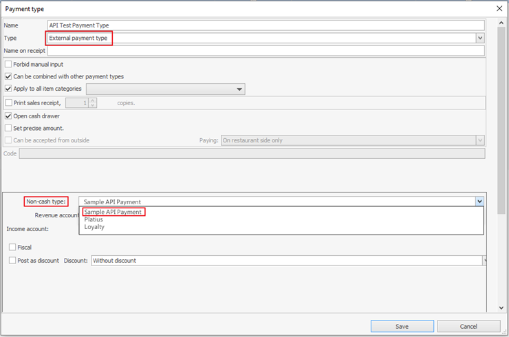
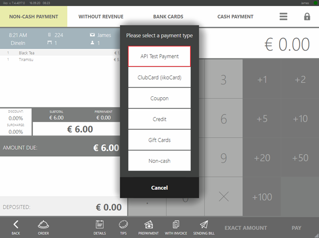

# Integration With External Payment Types
## Overview 
it the external payment type. 
Plugins used for external payment types must be [licensed](Licensing.html).


## External payment system registration
A plugin registers an external payment type using [`IOperationService.RegisterPaymentSystem(...)`](https://syrve.github.io/front.api.sdk/v6/html/M_Resto_Front_Api_IOperationService_RegisterPaymentSystem.htm).
`paymentSystem` is a required parameter to be passed to this method. It is a class instance that implements `IExternalPaymentProcessor`. 
Upon registration, a new payment system will be available in Syrve Office.
You can find it under the name [`IExternalPaymentProcessor.PaymentSystemName`](https://syrve.github.io/front.api.sdk/v6/html/P_Resto_Front_Api_IExternalPaymentProcessor_PaymentSystemName.htm) in the «Non-cash» type field if you select the «External Payment Type» as the payment type in the new payment type window.



If you add a [payment type](https://en.syrve.help/articles/#!office-8-5/topic-103) within this payment system, this external payment type will be available on Syrve POS terminals.



Explanation of terms:

- *Payment System* – defines the way payments are posted and returned. The payment system is used as a single instance in the entire Syrve RMS.
- *Payment Type* - refers to any payment system. It has customizable properties as fiscality, transfer accounts, and so on. If you make the external payment type fiscal, it will be classified as the *«Bank Cards»* type, if you leave it non-fiscal, it will fall within the *«Non-Cash Payment»* type. Within one payment system, you can add any number of payment types.
относится к какой-либо платёжной системе.
- *Payment Item* – refers to orders in Syrve POS. When a user while on the [payment screen](https://en.syrve.help/articles/#!syrve-pos-8-5/checkout) or [prepayment screen](https://en.syrve.help/articles/#!syrve-pos-8-5/checkout/a/h2_2092503229) selects any payment method, a payment item of a corresponding payment method is added to the order. Payment items can be added via the API ([Adding Payments](Payments.html)).

## IExternalPaymentProcessor Interface
To carry out the required business procedures of posting and refunding payments made using external payment types, the [`IExternalPaymentProcessor`](https://syrve.github.io/front.api.sdk/v6/html/T_Resto_Front_Api_IExternalPaymentProcessor.htm) interface needs to be implemented

```cs
public interface IExternalPaymentProcessor
{
    string PaymentSystemKey { get; }
    string PaymentSystemName { get; }
    void CollectData(Guid orderId, Guid paymentTypeId, [NotNull] IUser cashier, IReceiptPrinter printer, UI.IViewManager viewManager, IPaymentDataContext context, UI.IProgressBar progressBar);
    void OnPaymentAdded([NotNull] IOrder order, [NotNull] IPaymentItem paymentItem, [NotNull] IUser cashier, [NotNull] IOperationService operationService, IReceiptPrinter printer, UI.IViewManager viewManager, IPaymentDataContext context, UI.IProgressBar progressBar);
    bool OnPreliminaryPaymentEditing([NotNull] IOrder order, [NotNull] IPaymentItem paymentItem, [NotNull] IUser cashier, [NotNull] IOperationService operationService, IReceiptPrinter printer, UI.IViewManager viewManager, IPaymentDataContext context, UI.IProgressBar progressBar);
    void Pay(decimal sum, Guid? orderId, Guid paymentTypeId, Guid transactionId, [NotNull] IPointOfSale pointOfSale, [NotNull] IUser cashier, IReceiptPrinter printer, IViewManager viewManager, IPaymentDataContext context, IProgressBar progressBar);
    void EmergencyCancelPayment(decimal sum, Guid? orderId, Guid paymentTypeId, Guid transactionId, [NotNull] IPointOfSale pointOfSale, [NotNull] IUser cashier, IReceiptPrinter printer, IViewManager viewManager, IPaymentDataContext context, IProgressBar progressBar);
    void ReturnPayment(decimal sum, Guid? orderId, Guid paymentTypeId, Guid transactionId, [NotNull] IPointOfSale pointOfSale, [NotNull] IUser cashier, IReceiptPrinter printer, IViewManager viewManager, IPaymentDataContext context, IProgressBar progressBar);
    void ReturnPaymentWithoutOrder(decimal sum, Guid paymentTypeId, [NotNull] IPointOfSale pointOfSale, [NotNull] IUser cashier, IReceiptPrinter printer, IViewManager viewManager, IProgressBar progressBar);
    void PaySilently(decimal sum, Guid? orderId, Guid paymentTypeId, Guid transactionId, [NotNull] IPointOfSale pointOfSale, [NotNull] IUser cashier, IReceiptPrinter printer, IPaymentDataContext context);
    void EmergencyCancelPaymentSilently(decimal sum, Guid? orderId, Guid paymentTypeId, Guid transactionId, [NotNull] IPointOfSale pointOfSale, [NotNull] IUser cashier, IReceiptPrinter printer, IPaymentDataContext context);
    bool CanPaySilently(decimal sum, Guid? orderId, Guid paymentTypeId, IPaymentDataContext context);
}
```

Where:

- `PaymentSystemKey` – is a unique key the new external payment system takes at the registration.
- `PaymentSystemName` – is a name to be displayed in the Syrve Office UI.


## Payment Processing Methods
When a user selects a payment type on the Syrve POS payment screen, specifies the amount, and presses the *«Pay»* button or when a user deposits a prepayment using a certain payment type, the control will use the [`Pay()`](https://syrve.github.io/front.api.sdk/v6/html/M_Resto_Front_Api_IExternalPaymentProcessor_Pay.htm) method:
```cs
void Pay(decimal sum, Guid? orderId, Guid paymentTypeId, Guid transactionId, [NotNull] IPointOfSale pointOfSale, [NotNull] IUser cashier, IReceiptPrinter printer, IViewManager viewManager, IPaymentDataContext context, IProgressBar progressBar);
```

Where:

- `sum` – payment amount;
- `orderId` – Syrve POS order ID;
- `paymentTypeId` – payment type ID The list of all payment types can be obtained using the [`IOperationService.GetPaymentTypes()`](https://syrve.github.io/front.api.sdk/v6/html/M_Resto_Front_Api_IOperationService_GetPaymentTypes.htm) method; a specific payment type can be obtained using the [`OperationService_TryGetPaymentTypeById(...)`](https://syrve.github.io/front.api.sdk/v6/html/M_Resto_Front_Api_IOperationService_TryGetPaymentTypeById.htm) method;
- `transactionId` – transaction ID;
- `pointOfSale` – [`Point of sale`](GroupsAndPointsOfSale.html) where this payment item is processed;
- `cashier` – cashier;
- `printer` – instance of [`IReceiptPrinter`](https://syrve.github.io/front.api.sdk/v6/html/T_Resto_Front_Api_IReceiptPrinter.htm) that enables printing on the Syrve POS receipt printer;
- `viewManager` – instance of [`IViewManager`](https://syrve.github.io/front.api.sdk/v6/html/T_Resto_Front_Api_UI_IViewManager.htm) used to [view windows](ViewManager.html) while processing payments;
- `context` – instance of [`IPaymentDataContext`](https://syrve.github.io/front.api.sdk/v6/html/T_Resto_Front_Api_IPaymentDataContext.htm) used to save data in the payment item;
- `progressBar` – instance of [`IProgressBar`](https://syrve.github.io/front.api.sdk/v6/html/T_Resto_Front_Api_UI_IProgressBar.htm) used to change the text in the progress bar while processing payments.

For details on the object signature, please refer to the [documentation](https://syrve.github.io/front.api.sdk/v6).

If you, for example, need to integrate with a hotel system:

- When taking payments, you need to ask users to provide a room number or produce a room key.
- Then refer to the hotel service.
- If successful, print a receipt with the amount and guest name received from the hotel system.
- Go to Syrve RMS and save the entered number or swiped card to see the details in OLAP reports.
- Shall a refund be required, you will need to know whether a card or a number is used.
- If not successful, abort the payment.

```cs
[Serializable]
internal class IsCardClass
{
    public bool IsCard;
}
public void Pay(decimal sum, Guid? orderId, Guid paymentTypeId, Guid transactionId, IPointOfSale pointOfSale,  IUser cashier, IReceiptPrinter printer, IViewManager viewManager, IPaymentDataContext context, IProgressBar progressBar)
{
    // Show number input and card swiping dialog in Syrve POS
    var input = viewManager.ShowInputDialog("Enter the number or swipe the card", InputDialogTypes.Card | InputDialogTypes.Number);
    string room = null;
    string cardTrack = null;
    
    // If number is entered, result is NumberInputDialogResult
    var roomNum = input as NumberInputDialogResult;
    if (roomNum != null)
        room = roomNum.Number.ToString();
    
    // If card is swiped, result is CardInputDialogResult
    var card = input as CardInputDialogResult;
    if (card != null)
        cardTrack = card.FullCardTrack;
    
    if (room == null && cardTrack == null)
        // Nothing entered, operation is aborted.
        throw new PaymentActionFailedException("No data entered.");
    
    // Get order using API by ID via IOperationService.
    var order = PluginContext.Operations.TryGetOrderById(orderId.Value);
    
    // Running random methods. For instance, effecting payment in some hotelSystem which would return the guest name if the payment is accepted and null, if the payment is declined.
    var guestName = hotelSystem.ProcessPaymentOnGuest(cardTrack, room, order?.Number, transactionId, sum);
    if (guestName == null)
        // Payment not processed, operation is aborted.
        throw new PaymentActionFailedException("Payment not processed.");
    
    // Preparing receipt for printing. Receipt includes XElement
    var slip = new ReceiptSlip
    {
        Doc =  new XElement(Tags.Doc,
            new XElement(Tags.Pair, "Гость", guestName),
            new XElement(Tags.Pair, "Сумма", sum))
    };
    
    // Printing.
    printer.Print(slip);
    var cardInfoData = new IsCardClass { IsCard = card != null };
    var cardType = cardInfoData.IsCard
        ? "My Hotel System Card"
        : "My Hotel System Room";
    // Saving the data to be given in reports.
    context.SetInfoForReports(room ?? cardTrack, cardType);
    // Saving the data to be used for refund.
    context.SetRollbackData(cardInfoData);
}
```
 
The [`PaymentActionFailedException`](https://syrve.github.io/front.api.sdk/v6/html/T_Resto_Front_Api_Exceptions_PaymentActionFailedException.htm) payment exclusion serves to abort the payment operation. An Syrve POS user will be shown the exception `message`. This makes sense if any issues occurred during the communication with the external service, the payment cannot be processed, and a user must be informed of the reasons. 

To abort the operation silently, you can use the [`PaymentActionCancelledException`](https://syrve.github.io/front.api.sdk/v6/html/T_Resto_Front_Api_Exceptions_PaymentActionCancelledException.htm)exception. It makes sense if in the process of payment, a dialog box is displayed and a user selects *«Cancel»*.

Arguments [`IReceiptPrinter`](https://syrve.github.io/front.api.sdk/v6/html/T_Resto_Front_Api_IReceiptPrinter.htm), [`IViewManager`](https://syrve.github.io/front.api.sdk/v6/html/T_Resto_Front_Api_UI_IViewManager.htm) and  [`IPaymentDataContext`](https://syrve.github.io/front.api.sdk/v6/html/T_Resto_Front_Api_IPaymentDataContext.htm) exist only while the method is running; once the method is complete, the instances are removed. So there is no point to save them as variables for they cannot be used outside the method.

### Silent Payment
Sometimes, businesses need solutions to effect plugin payments within the very plugins but without the Syrve POS cash register screen. For this, the plugin should implement the [`CanPaySilently`](https://syrve.github.io/front.api.sdk/v6/html/M_Resto_Front_Api_IExternalPaymentProcessor_CanPaySilently.htm) method of the plugin payment processor. The method result is the answer to this question: *«Whether or not the plugin can process silent payments?»*.
To make this possible, an order should have a plugin payment item added. Silent payments may require the [`ProcessPrepay`](https://syrve.github.io/front.api.sdk/v6/html/M_Resto_Front_Api_IOperationService_ProcessPrepay.htm) method with the `isProcessed` flag set to `false` to be called.
The `SDK` shows a use case of the user-written class with the *SilentPay* property:

```cs
[Serializable]
public class PaymentAdditionalData
{
    public bool SilentPay { get; set; }
}

private string Serialize<T>(T data) where T : class
{
    using (var sw = new StringWriter())
    using (var writer = XmlWriter.Create(sw))
    {
        new XmlSerializer(typeof(T)).Serialize(writer, data);
        return sw.ToString();
    }
}
private void AddAndProcessExternalPrepay()
{
    var order = PluginContext.Operations.GetOrders().Last(o => o.Status == OrderStatus.New);
    var paymentType = PluginContext.Operations.GetPaymentTypes().Single(i => i.Kind == PaymentTypeKind.External && i.Name == "SamplePaymentType");
    
    var additionalData = new ExternalPaymentItemAdditionalData
    {
        CustomData = Serialize(new PaymentAdditionalData {SilentPay = true})
    };
    var credentials = PluginContext.Operations.AuthenticateByPin("777");
    var paymentItem = PluginContext.Operations.AddExternalPaymentItem(order.ResultSum, false, additionalData, paymentType, order, credentials);

    PluginContext.Operations.ProcessPrepay(credentials, order, paymentItem);
}
```

In turn, Syrve POS sends the specified serialized class to the payment context ([`IPaymentContext`](https://syrve.github.io/front.api.sdk/v6/html/T_Resto_Front_Api_IPaymentDataContext.htm)) and then this class is extracted and deserialized in the [`CanPaySilently`](https://syrve.github.io/front.api.sdk/v6/html/M_Resto_Front_Api_IExternalPaymentProcessor_CanPaySilently.htm) method.

```
public bool CanPaySilently(decimal sum, Guid? orderId, Guid paymentTypeId, IPaymentDataContext context)
{
    var customData = context.GetCustomData<PaymentAdditionalData>();    
    return customData?.SilentPay ?? false;
}
```

Depending on the [`CanPaySilently`](https://syrve.github.io/front.api.sdk/v6/html/M_Resto_Front_Api_IExternalPaymentProcessor_CanPaySilently.htm) response, Syrve POS would call `Pay` or `PaySilently` plugin processor method. Therefore, the plugin defines the way a new payment should be processed.

## Refund Methods

```cs
void EmergencyCancelPayment(decimal sum, Guid? orderId, Guid paymentTypeId, Guid transactionId, [NotNull] IPointOfSale pointOfSale, [NotNull] IUser cashier, IReceiptPrinter printer, IViewManager viewManager, IPaymentDataContext context, IProgressBar progressBar);
void ReturnPayment(decimal sum, Guid? orderId, Guid paymentTypeId, Guid transactionId, [NotNull] IPointOfSale pointOfSale, [NotNull] IUser cashier, IReceiptPrinter printer, IViewManager viewManager, IPaymentDataContext context, IProgressBar progressBar);
void ReturnPaymentWithoutOrder(decimal sum, Guid paymentTypeId, [NotNull] IPointOfSale pointOfSale, [NotNull] IUser cashier, IReceiptPrinter printer, IViewManager viewManager, IProgressBar progressBar);
void EmergencyCancelPaymentSilently(decimal sum, Guid? orderId, Guid paymentTypeId, Guid transactionId, [NotNull] IPointOfSale pointOfSale, [NotNull] IUser cashier, IReceiptPrinter printer, IPaymentDataContext context);
```

The `EmergencyCancelPayment()` and `ReturnPayment()` methods are called when a user makes a refund on Syrve POS.

The  `ReturnPayment()` method takes over when the *«Refund»* or *«Delete order»* button is tapped on the closed order screen. Or if a user deletes a posted payment. The `EmergencyCancelPayment()` takes over when a posted payment is canceled in the open order. For instance, if the fiscal payment is canceled due to the fiscal receipt printing error. If the last case does not require any specific logic, the `ReturnPayment()` method can be called from the `EmergencyCancelPayment()`. 

The methods take the same parameters as the payment methods. `transactionId` is the same as the one sent to the operation earlier performed `Pay()`.

Methods are considered completed if no exceptions, like `PaymentActionFailedException` or `PaymentActionCancelledException`, occurred in the process. If such exceptions took place, the refund operation is aborted as is the case with the payment.

Hotel integration code sample. The refund method cancels the transaction and prints a receipt with the refund amount and saved details: card swiped or number entered.

```cs
[Serializable]
public class IsCardClass
{
    public bool IsCard;
}

public void ReturnPayment(decimal sum, Guid? orderId, Guid paymentTypeId, Guid transactionId, [NotNull] IPointOfSale pointOfSale, [NotNull] IUser cashier, IReceiptPrinter printer, IViewManager viewManager, IPaymentDataContext context, IProgressBar progressBar)
{
    // Running random methods. For example, payment is refunded by the transaction ID in some hotelSystem which would return true if the payment is refunded successfully and false if the refund failed.
    var success = hotelSystem.ProcessReturnPayment(transactionId);
    if (!success)
        throw new PaymentActionFailedException("Failed to refund.");
    
    // Obtaining data saved in the payment item.
    var isCard = context.GetRollbackData<IsCardClass>();
    
    var slip = new ReceiptSlip
    {
        Doc =  new XElement(Tags.Doc, 
            new XElement(Tags.Pair, "Payment refund", sum),
            new XElement(Tags.Pair, "Was the card used", isCard.IsCard ? "YES" :    "NO" ))
    };
    printer.Print(slip);
}

public void EmergencyCancelPayment(decimal sum, Guid? orderId, Guid paymentTypeId, Guid transactionId, [NotNull] IPointOfSale pointOfSale, [NotNull] IUser cashier, IReceiptPrinter printer, IViewManager viewManager, IPaymentDataContext context, IProgressBar progressBar)
{
    ReturnPayment(sum, orderId, paymentTypeId, transactionId, pointOfSale, cashier, printer, viewManager, context, progressBar);
}
```

The [`ReturnPaymentWithoutOrder()`](https://syrve.github.io/front.api.sdk/v6/html/M_Resto_Front_Api_IExternalPaymentProcessor_ReturnPaymentWithoutOrder.htm) method is called when the [external payment refund](https://en.syrve.help/articles/#!pos-8-4/product-return) takes place. You can refund items using external types even if orders are not prepaid. To be able to select the external type in the refund UI, you need to register the payment system with the optional `canProcessPaymentReturnWithoutOrder = true` parameter. That is

```cs
var disposable = PluginContext.Operations.RegisterPaymentSystem(paymentSystem, true);
```

Unlike other methods mentioned above, the `ReturnPaymentWithoutOrder()` method has neither order nor prepayment context. We assume that such details as the amount and payment method are enough to make a refund. In the process, you can show dialogs to users and print receipts as is the case with other methods mentioned above.


## Data Collection Methods

```cs
void CollectData(Guid orderId, Guid paymentTypeId, [NotNull] IUser cashier, IReceiptPrinter printer, UI.IViewManager viewManager, IPaymentDataContext context, UI.IProgressBar progressBar);
void OnPaymentAdded([NotNull] IOrder order, [NotNull] IPaymentItem paymentItem, [NotNull] IUser cashier, [NotNull] IOperationService operationService, IReceiptPrinter printer, UI.IViewManager viewManager, IPaymentDataContext context, UI.IProgressBar progressBar);
bool OnPreliminaryPaymentEditing([NotNull] IOrder order, [NotNull] IPaymentItem paymentItem, [NotNull] IUser cashier, [NotNull] IOperationService operationService, IReceiptPrinter printer, UI.IViewManager viewManager, IPaymentDataContext context, UI.IProgressBar progressBar);
```

If you need to collect any data at the time an external payment item is added to the order rather than the moment when the *«Pay»* button is hit, you can change the `CollectData()` method accordingly. 

The `OnPaymentAdded()` method is called out once the payment item is added to the order. This method is special for having `IOperationService operationService` as one of its arguments. Unlike  [`PluginContext.Operations`](https://syrve.github.io/front.api.sdk/v6/html/P_Resto_Front_Api_PluginContext_Operations.htm), this instance is privileged to change the current order. This may be required, for example, to set the payment item amount or even add any menu item to the order.
 
The  [`OnPreliminaryPaymentEditing()`](https://syrve.github.io/front.api.sdk/v6/html/M_Resto_Front_Api_IExternalPaymentProcessor_OnPreliminaryPaymentEditing.htm) is called out when editing prepayments. This method may also change the current order using the `IOperationService operationService` argument. The method returns `bool`, the meaning of which is the following: whether or not the prepayment item amount can be changed in the UI once the method is complete.


## Closing & Opening Till Shifts in Syrve POS
Some external payment systems need to perform certain actions on their side at the time a till shift is opened or closed in Syrve POS. For instance, banking systems need to carry out the verification at the till shift closing. For this, you need to subscribe to  [`INotificationService.SubscribeOnCafeSessionOpening`](https://syrve.github.io/front.api.sdk/v6/html/M_Resto_Front_Api_INotificationService_SubscribeOnCafeSessionOpening.htm) and [`INotificationService.SubscribeOnCafeSessionClosing`](https://syrve.github.io/front.api.sdk/v6/html/M_Resto_Front_Api_INotificationService_SubscribeOnCafeSessionClosing.htm).

When you open or close a till shift, a corresponding observer receives a new event. Code sample which, at the time of opening or closing a shift, prints the payment system key and whether the shift is closed or opened:

```cs
ctor
{
    // ...   
    PluginContext.Notifications.SubscribeOnCafeSessionClosing(CafeSessionClosing);
    PluginContext.Notifications.SubscribeOnCafeSessionOpening(CafeSessionOpening)                
}

private void CafeSessionOpening([NotNull] IReceiptPrinter printer, [NotNull] IProgressBar progressBar)
{
    PluginContext.Log.Info("Cafe session opening.");
    var message =
        "I cannot connect to my server and open a shift.";
    PluginContext.Operations.AddNotificationMessage(message, "SamplePaymentPlugin");
}

private void CafeSessionClosing([NotNull] IReceiptPrinter printer, [NotNull] IProgressBar progressBar)
{
    PluginContext.Log.Info("Cafe session closing.");
    var slip = new ReceiptSlip
    {
        Doc = new XElement(Tags.Doc,
            new XElement(Tags.Center, PaymentSystemKey),
            new XElement(Tags.Center, "Cafe session closed."))
    };
    printer.Print(slip);
}
```

If you need to give a user any warning, you can use notifications. Exceptions that occur while running `CafeSessionOpening()` and `CafeSessionClosing()`do not interrupt till shift opening or closing operations in Syrve POS. Moreover, if the processor encounters some exceptions, it is considered broken and is not called out until the plugin is restarted.
 
