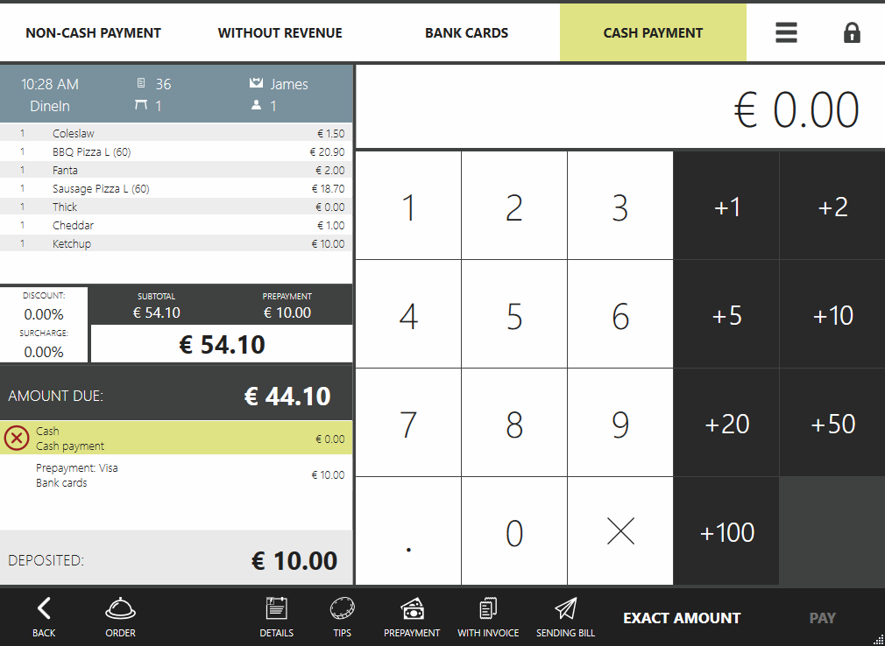
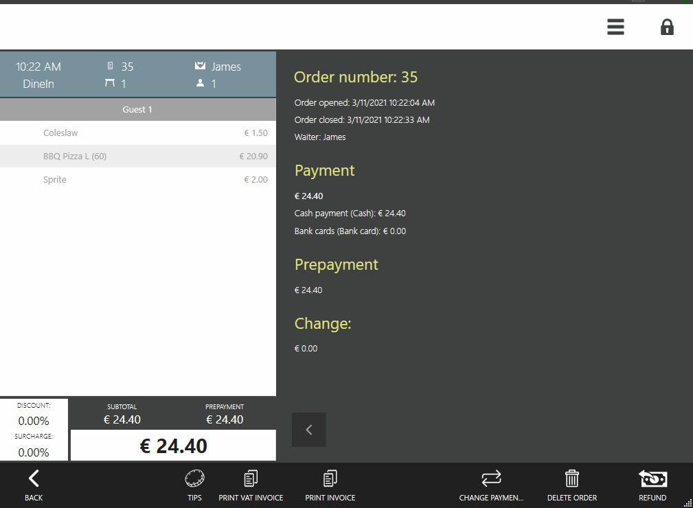
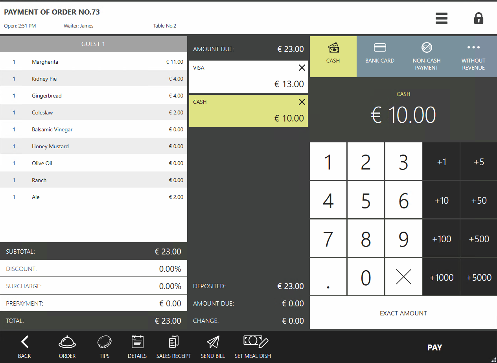
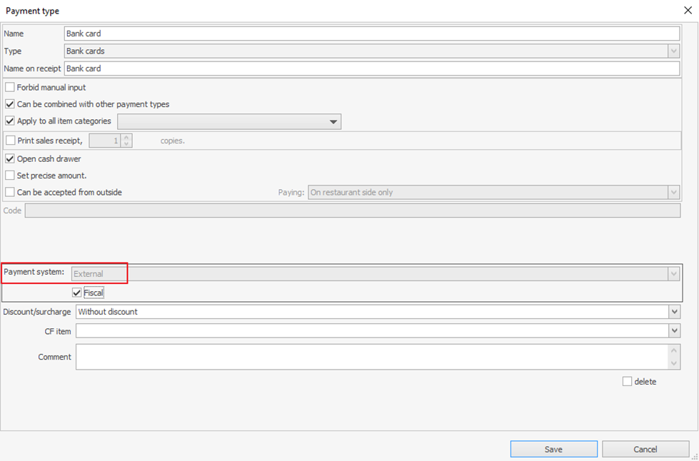

## Adding Payments
The following methods are used to add payments

- [IEditSession.AddPaymentItem](https://syrve.github.io/front.api.sdk/v6/html/Overload_Resto_Front_Api_Editors_IEditSession_AddPaymentItem.htm) — add a payment

- [IEditSession.AddExternalPaymentItem](https://syrve.github.io/front.api.sdk/v6/html/Overload_Resto_Front_Api_Editors_IEditSession_AddExternalPaymentItem.htm) — add an external payment

- [IEditSession.AddPreliminaryPaymentItem](https://syrve.github.io/front.api.sdk/v6/html/Overload_Resto_Front_Api_Editors_IEditSession_AddPreliminaryPaymentItem.htm) — add an advance payment (*it is useful for delivery orders only*)

You can also use the same-name [methods](https://syrve.github.io/front.api.sdk/v6/html/Methods_T_Resto_Front_Api_Extensions_OperationServiceExtensions.htm) of extension operations where the [editing session]({{ site.baseurl }}/v6/en/Data%20editing.html) is created implicitly (*as opposed to multiple order actions. If apart from payment, you need, for instance, to add a guest, use methods within the editing session*). To set up and register external payment types, see the [External Payment Types](PaymentProcessor.html) article.

##### Payment restrictions:
Payment can be added only if the order is `New` or the `Guest Bill` is printed, otherwise, the method throws the [`ConstraintViolationException`](https://syrve.github.io/front.api.sdk/v6/html/T_Resto_Front_Api_Exceptions_ConstraintViolationException.htm)exception. Besides, you cannot add several unposted payments of one type (*NOTE: it is planned to lift this restriction*).

##### Examples

- Adding cash payments

```cs
var deliveryOrder = PluginContext.Operations.GetDeliveryOrders().Last(o => o.Status == OrderStatus.New);
var paymentType = PluginContext.Operations.GetPaymentTypes().Last(x => x.Kind == PaymentTypeKind.Card && x.Name.ToUpper() == "DINERS");
var additionalData = new CardPaymentItemAdditionalData { CardNumber = "123456" };
PluginContext.Operations.AddPreliminaryPaymentItem(150, additionalData, paymentType, deliveryOrder, PluginContext.Operations.GetCredentials());
```

- Adding card payments to delivery orders

```cs
var deliveryOrder = PluginContext.Operations.GetDeliveryOrders().Last(o => o.Status == OrderStatus.New);
var paymentType = PluginContext.Operations.GetPaymentTypes().Last(x => x.Kind == PaymentTypeKind.Card && x.Name.ToUpper() == "DINERS");
var additionalData = new CardPaymentItemAdditionalData { CardNumber = "123456" };
PluginContext.Operations.AddPreliminaryPaymentItem(150, additionalData, paymentType, deliveryOrder, PluginContext.Operations.GetCredentials());
```

- Adding external unposted payments

```cs
var order = PluginContext.Operations.GetOrders().Last(o => o.Status == OrderStatus.New);
var paymentType = PluginContext.Operations.GetPaymentTypes().Last(x => x.Kind == PaymentTypeKind.Card && x.Name.ToUpper() == "Visa Bank cards");
var additionalData = new CardPaymentItemAdditionalData { CardNumber = "123456" };
PluginContext.Operations.AddExternalPaymentItem(10, false, additionalData, paymentType, order, PluginContext.Operations.GetCredentials());
```



Comments:
- The `PluginContext.Operations.GetOrders().Last(...)` expression is used in the examples, which means getting the last order on the list. Use a corresponding selection criterion to solve business tasks.
- `PluginContext.Operations.GetCredentials()` — hereinafter, examples show an extension method [made available](https://github.com/syrve/front.api.sdk/blob/main/sample/v6/Resto.Front.Api.SamplePlugin/OperationServiceExtensions.cs) in the SamplePlugin example.

## Payment for the order
The following methods are used to pay orders:

- [IOperationService.PayOrder](https://syrve.github.io/front.api.sdk/v6/html/M_Resto_Front_Api_IOperationService_PayOrder.htm) — order payment

- [IOperationService.PayOrderAndPayOutOnUser](https://syrve.github.io/front.api.sdk/v6/html/M_Resto_Front_Api_IOperationService_PayOrderAndPayOutOnUser.htm) — order payment to waiter
there is also a method to convert the payment into prepayment in the POS

- [IOperationService.ProcessPrepay](https://syrve.github.io/front.api.sdk/v6/html/M_Resto_Front_Api_IOperationService_ProcessPrepay.htm)

If the payment is effected using the fiscal cash method, then the user, on behalf of which the `IOperationService.PayOrderAndPayOutOnUser` is made, will have the [fiscal withdrawal](https://en.syrve.help/articles/#!syrve-pos-8-5/pay-order-to-waiter).

#### Examples

##### Payment for an order that has enough deposited funds

Assume there is an IOrder order that needs to be closed in Syrve POS. This order has enough posted payments: *prepayments made on the POS checkout screen or payments initiated by the plugin using the `AddExternalPaymentItem` method with the `isProcessed` flag that is `true`*. This order can have the following method invoked:

```cs
operationService.PayOrder(credentials, order);
```



##### Paying the order in cash to the waiter

Assume there is an `IOrder order` that needs to be tendered to cash in full and closed in Syrve POS. For this, select a corresponding `paymentType`. Then invoke the `IOperationService.PayOrderAndPayOutOnUser` method. In the following example, an order is fully paid in cash:

```cs
var order = PluginContext.Operations.GetOrders().Last(o => o.Status == OrderStatus.New || o.Status == OrderStatus.Bill);
var credentials = PluginContext.Operations.AuthenticateByPin("777");
var paymentType = operationService.GetPaymentTypesToPayOutOnUser().First(x => x.IsCash);
PluginContext.Operations.PayOrderAndPayOutOnUser(credentials, order, paymentType, order.ResultSum);
```

##### Paying the order using plugins

Assume there is an `IOrder order` that needs to be tendered using a plugin payment method.

```cs
var order = PluginContext.Operations.GetOrders().Last(o => o.Status == OrderStatus.New);
var paymentType = PluginContext.Operations.GetPaymentTypes().Single(i => i.Kind== PaymentTypeKind.External && i.Name == "SamplePaymentType");
var credentials = PluginContext.Operations.GetCredentials();
PluginContext.Operations.PayOrderAndPayOutOnUser(credentials, order, paymentType, order.ResultSum);
```

##### Comments:
- When paying orders on the main cash register (during the main cash register till shift) using [IOperationService.PayOrder](https://syrve.github.io/front.api.sdk/v6/html/M_Resto_Front_Api_IOperationService_PayOrder.htm) or
 [IOperationService.PayOrderAndPayOutOnUser](https://syrve.github.io/front.api.sdk/v6/html/M_Resto_Front_Api_IOperationService_PayOrderAndPayOutOnUser.htm) methods, the order will be closed and given on the corresponding list in Syrve POS and all required receipts and the fiscal bill printed.

### Refunding
For now, refunds and order returns cannot be initiated by the plugin, therefore, it should be done on Syrve POS-powered terminals by users.

### Payment processing

#### Adding externally-processed payments
Sometimes it is required to add payments processed outside Syrve POS. For this, the `AddExternalPaymentItem` method is used. The `isProcessed` parameter is `true`. In this case, Syrve POS treats the required payment transactions as externally processed. Therefore, it does not process them but rather marks them as posted.

##### Example

```cs
var order = PluginContext.Operations.GetOrders().Last(o => o.Status == OrderStatus.New);
var paymentType = PluginContext.Operations.GetPaymentTypes().Last(x => x.Kind == PaymentTypeKind.Cash);
PluginContext.Operations.AddExternalPaymentItem(150, true, null, paymentType, order, PluginContext.Operations.GetCredentials());
```



#### Adding processed payments and converting them into Syrve POS prepayments

Once in a while, such payments need to be added to the order and displayed in Syrve Office reports before closing the order. Then the `AddExternalPaymentItem` payment with the `true` `isProcessed` parameter needs to be added. Then, invoke the [IOperationService.ProcessPrepay](https://syrve.github.io/front.api.sdk/v6/html/M_Resto_Front_Api_IOperationService_ProcessPrepay.htm) method.

##### Example

```cs
var order = PluginContext.Operations.GetOrders().Last(o => o.Status == OrderStatus.New);
var paymentType = PluginContext.Operations.GetPaymentTypes().Last(x > x.Kind == PaymentTypeKind.Card && x.Name.ToUpper() == "DINERS");
var additionalData = new CardPaymentItemAdditionalData { CardNumber  "123456" };
var credentials = PluginContext.Operations.GetCredentials();
var paymentItem = PluginContext.Operations.AddExternalPaymentItem(150, true, additionalData, paymentType, order, credentials);
order = PluginContext.Operations.GetOrderById(order.Id);
PluginContext.Operations.ProcessPrepay(credentials, order, paymentItem);
```


#### Adding prepayments and converting them into Syrve POS prepayments

To pay for a delivery order, first add a prepayment using the method [IEditSession.AddPreliminaryPaymentItem](https://syrve.github.io/front.api.sdk/v6/html/Overload_Resto_Front_Api_Editors_IEditSession_AddPreliminaryPaymentItem.htm) method and then invoke the [IOperationService.ProcessPrepay](https://syrve.github.io/front.api.sdk/v6/html/M_Resto_Front_Api_IOperationService_ProcessPrepay.htm) method.

##### Example

```cs
var order = PluginContext.Operations.GetDeliveryOrders().Last(o => o.Status == OrderStatus.New || o.Status == OrderStatus.Bill);
var paymentType = PluginContext.Operations.GetPaymentTypes().Last(i => i.Kind == PaymentTypeKind.Cash);
var credentials = PluginContext.Operations.GetCredentials();
var paymentItem = PluginContext.Operations.AddPreliminaryPaymentItem(order.ResultSum, null, paymentType, order, credentials);
PluginContext.Operations.ProcessPrepay(credentials, PluginContext.Operations.GetDeliveryOrderById(order.Id), paymentItem);
```

## Payment types that support silent processing (Silent Payment)
From time to time, customers need to post prepayments and add tips through the plugin (without using Syrve POS functionality) as not processed payments to be further processed on the POS. Not processed or unposted payment means that is was created with the `false` `isProcessed` flag. For the payments to be processed by the plugin, they should support the so called silent payment — when the processing does not require the interaction with the Syrve POS user interface (e.g. to collect data). It is believed that all the necessary data is collected. Some payment types support the silent payment by default:

- Cash
- Bank cards, the payment system of which is set to “External”. The payment system must be configured in Syrve Office the following way:



The silent payment can also be made available for the external plugin type. For details, see the [External Payment Methods](PaymentProcessor.html) article.

**Other Settings:**
- For adding tips, please check the [Tips](Donations.html).

## Removing Payments

- [IEditSession.DeletePaymentItem](https://syrve.github.io/front.api.sdk/v6/html/M_Resto_Front_Api_Editors_IEditSession_DeletePaymentItem.htm) — delete payment

- [IEditSession.DeleteExternalPaymentItem](https://syrve.github.io/front.api.sdk/v6/html/M_Resto_Front_Api_Editors_IEditSession_DeleteExternalPaymentItem.htm) — delete external payment

- [IEditSession.DeletePreliminaryPaymentItem](https://syrve.github.io/front.api.sdk/v6/html/M_Resto_Front_Api_Editors_IEditSession_DeletePreliminaryPaymentItem.htm) &— delete advance payment (*it is useful for delivery orders only*)

##### Example

- Removing external payments from the order

```cs
var order = PluginContext.Operations.GetOrders().Last(o => o.Status == OrderStatus.New);
var paymentItem = order.Payments.FirstOrDefault(i => i.IsExternal);
if (paymentItem != null)
 PluginContext.Operations.DeleteExternalPaymentItem(paymentItem, order, PluginContext.Operations.GetCredentials());
```

For more examples, please check the SDK SamplePaymentPlugin project.