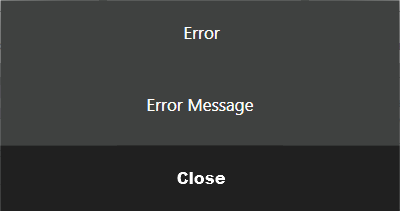
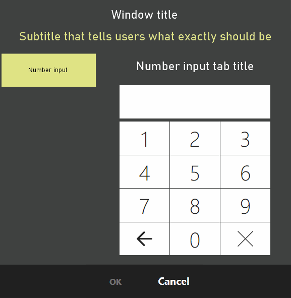

# ViewManager Functionality

## «Access Points» 
[`IViewManager`](https://syrve.github.io/front.api.sdk/v6/html/T_Resto_Front_Api_UI_IViewManager.htm) allows displaying preset Syrve POS dialogs. This is possible when Syrve POS transfers control to the plugin within a modal operation by calling a corresponding method and feeding an `IViewManager` instance to it as one of the arguments. This object is only relevant within the method it is fed to, and will be eliminated when the plugin returns control from the method. 

Examples of modal operations:

- [Invoking](https://syrve.github.io/front.api.sdk/v6/html/M_Resto_Front_Api_UI_Button_PerformAction.htm) of the button pressing processor for a button [added](https://syrve.github.io/front.api.sdk/v6/html/M_Resto_Front_Api_IPluginIntegrationService_AddButton.htm) by the plugin in the Advanced menu. 
- Interaction with the payment method made available within the plugin: data collection, posting, and refund processes (see [`IExternalPaymentProcessor`](https://syrve.github.io/front.api.sdk/v6/html/Methods_T_Resto_Front_Api_IExternalPaymentProcessor.htm)) (see the [External Payment Methods API](PaymentProcessor.html) article)*

## General Concept
A plugin invokes a method and processes the result: `var result = viewManager.ShowSomething(...)`. Depending on the method signature, the plugin receives whether a primitive variable (`bool`, `int`, `string`) or an [`IInputDialogResult`](https://syrve.github.io/front.api.sdk/v6/html/T_Resto_Front_Api_Data_View_IInputDialogResult.htm) instance based on the semantics.

If the business logic requires value validation (for instance, the hotel room number availability needs to be verified), the proper approach is the following:

- a user closes the dialog
- a plugin validates the result
- if the validation does not succeed, the dialog pops up again


In the case of notifications that do not require the user’s response, it is recommended to use non-modal pop-ups (see [notification](https://syrve.github.io/front.api.sdk/v6/html/M_Resto_Front_Api_IOperationService_AddNotificationMessage_1.htm ), [warning](https://syrve.github.io/front.api.sdk/v6/html/M_Resto_Front_Api_IOperationService_AddWarningMessage_1.htm), [error](https://syrve.github.io/front.api.sdk/v6/html/M_Resto_Front_Api_IOperationService_AddErrorMessage_1.htm))as they do not require the `IViewManager` instance, therefore, they can be shown at any time.  

## Description of Functionality
### Dialog with one button
`ShowOkPopup()` shows a dialog box with a heading, text, and the «OK» button that closes the dialog.


`ShowErrorPopup()` shows a dialog box with the «Error» heading, text, and the «Close» button.



### Dialog with two buttons «Yes/No»
`ShowYesNoPopup()` shows a dialog box with a heading, text, and two buttons, and returns `true` if «Yes» is pressed.


### Selection dialog
`ShowChooserPopup()` receives a list of strings and, optionally, the default item index as parameters and returns the index of the item of choice. It has the wrapping that receives a list of objects and the function to receive text representation of the object `Func<T, string> `, optionally, the default item, and returns the user-selected item. If an item is not selected by the user *(«Cancel» is pressed)*, `-1` or `null` comes in return. The button width can be specified as an optional parameter. The narrower the button, the more columns with buttons fit one page. By default, the button width is `ButtonWidth.Normal`.


### Custom lines input dialog
`ShowKeyboard()` shows a dialog with the on-screen keyboard. Available parameters:

- opening text
- multiline input allowed or not
- line length limit
- whether or not the first letter of each word should be capitalized *(it is convenient for proper names)*
- whether to mask the input or not *(if a password is keyed in)*
 


### Numbers input dialog 
`ShowInputDialog()` with the `type = InputTypes.Number` parameter and the `initialValue` optional parameter – starting value can be used to enter the number. To interpret the input result, the returnable `IInputDialogResult` needs to be brought to `NumberInputDialogResult`.


### Enumerated string input dialog
In addition to the one mentioned above, there is the `ShowExtendedInputDialog()` method. One of its parameters is the settings class `ExtendedInputDialogSettings`. If you set `ExtendedInputDialogSettings.EnableNumericString = true` there, users would be prompted to enter digits. Along with the setting, a descriptive text can be set `ExtendedInputDialogSettings.TabTitleNumericString`. Unlike the above-mentioned input method, the data entered within this method represent a string, which allows entering leading zeros, as well as large numbers, exceeding `int`. To interpret the input result, the returnable `IInputDialogResult` needs to be brought to`NumericStringInputDialogResult`.



Example:

```cs
var settings = new ExtendedInputDialogSettings
{
    EnableNumericString = true,
    TabTitleNumericString = “Number input tab title"
}
var dialogResult = viewManager.ShowExtendedInputDialog(
                “Window title”, 
                “Subtitle that tells users what exactly should be entered”,
                settings) 
    as NumericStringInputDialogResult;
if (dialogResult == null)
    return;
// analyze result
```

### Barcode input dialog 
The `ShowExtendedInputDialog()` method can be invoked with the `ExtendedInputDialogSettings.EnableBarcode = true` setting, which goes together with `ExtendedInputDialogSettings.TabTitleBarcode`. To interpret the input result, the returnable `IInputDialogResult` needs to be brought to `BarcodeInputDialogResult`.

### Phone number input dialog
Another setting of `ShowExtendedInputDialog()` is `ExtendedInputDialogSettings.EnablePhone = true`, which goes together with `ExtendedInputDialogSettings.TabTitlePhone`. In this case, user-specified data is validated according to the telephone number system settings; the input field includes the area code mask. Until the input data is not validated, «OK» will not be available. To interpret the input result, the returnable `IInputDialogResult` needs to be brought to `PhoneInputDialogResult`.


### Dialogs that allow card swiping
Card swiping can be enabled in both `ShowInputDialog()` and `ShowExtendedInputDialog()`. In the first case, `type = InputTypes.Card` needs to be specified, in the second – `ExtendedInputDialogSettings.EnableCardSlider = true`.  In both cases, to interpret the input result, the returnable `IInputDialogResult` needs to be brought to `CardInputDialogResult`.

### Miscellaneous
Input methods in `ShowInputDialog()` and `ShowExtendedInputDialog()` can be combined by using available settings together. For instance, a user can be asked to enter the card number or swipe their card. In this case, the returnable result needs to be brought to each of the expected result types.

Example 1 (code):

```cs
var result = viewManager.ShowInputDialog(
    “Enter the room number or swipe the card”
    InputDialogTypes.Number | InputDialogTypes.Card);

if (result is NumberInputDialogResult numeric)
    Operations.AddNotificationMessage($”Number entered {numeric.Number}", "SamplePlugin");
if (result is CardInputDialogResult card)
    Operations.AddNotificationMessage($”Card track {card.FullCardTrack}", "SamplePlugin");
```

Example 2 (possible layout and settings):


```cs
var settings = new ExtendedInputDialogSettings
{
    EnableBarcode = true,
    TabTitleBarcode = “Numeric value tab title",
    EnableCardSlider = true,
    EnableNumericString = true,
    TabTitleNumericString = “Barcode tab title" 
    EnablePhone = true,
    TabTitlePhone = “Phone tab title"
};
var dialogResult = viewManager.ShowExtendedInputDialog(
    “Window title”, 
    “Subtitle that explains what exactly the user needs to enter.”,
    settings);
```

## More about UI
The plugin can show its own dialogs, but this is not included in the Syrve POS API. Please check [another article](CustomWindows.html).