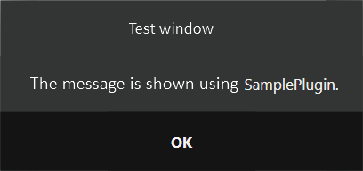
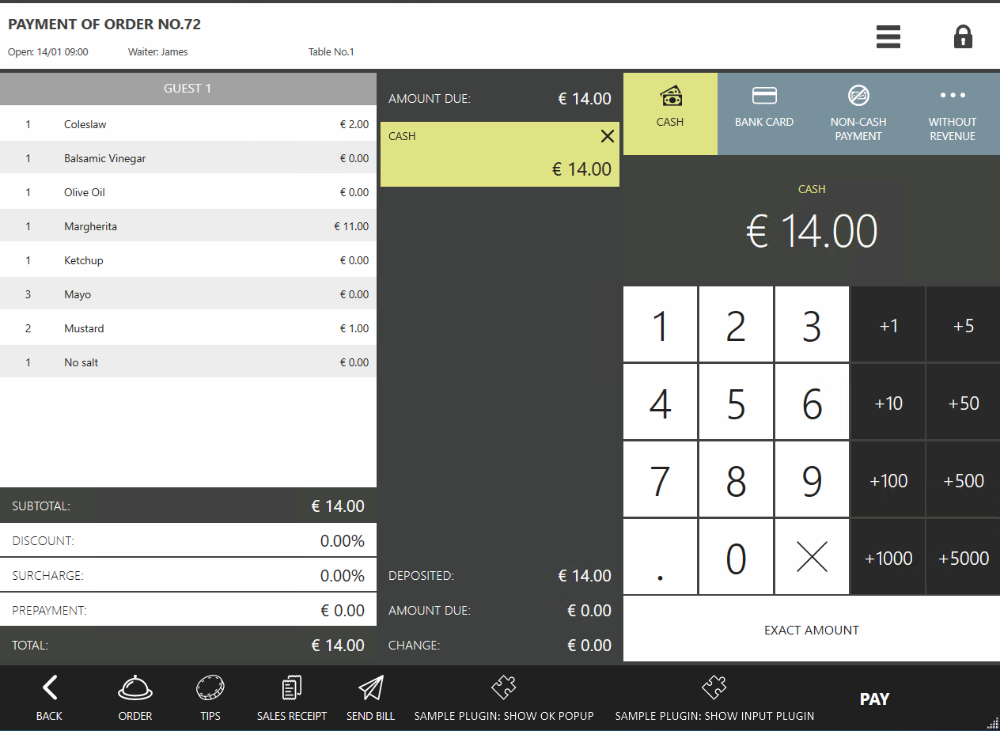
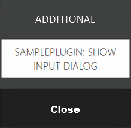

# Extending the functional of the cashbox screen #

On the cash screen, it is possible to add buttons that can do operations using the object of the current order, and also change their state.

## How does it look in Syrve POS?

For example, the *«SamplePlugin: Show OK popup»* button that is added by the SamplePlugin plugin from the SDK looks like this:

 

Suppose a plugin displays a window with a message (check the article [*API dialogs*](../../v6/en/ViewManager.html)).

 

Plugin can add a few buttons to the cash screen at once.

For example, two buttons were added by using the SamplePlugin SDK: *«SamplePlugin: Show OK popup»* and *«SamplePlugin: Show input dialog»*.



It may happen that there is not enough space to add the buttons. Then in place of the buttons that doesn't fit, the *«ADDITIONAL»* button will be placed.

 

If there is only one button, the *«ADDITIONAL»* button will not be displayed in any case.

Different plugins can add their buttons.

Pressing the *«ADDITIONAL»* button displays a list of all the buttons that did not fit.

 


## How to add my extensions?

##### Step 1: Registration of the handler for the cash screen:
 
```cs
// Registering an action on the cash screen
subscription = PluginContext.Operations.AddButtonToPaymentScreen("SamplePlugin: Show ok popup", false, true, ShowOkPopupOnPaymentScreen);
``` 

The [`AddButtonToPaymentScreen()`](https://syrve.github.io/front.api.sdk/v7/html/M_Resto_Front_Api_IOperationService_AddButtonToPaymentScreen.htm) function takes 5 arguments to input:

- `string caption` — button name, displayed on the UI.
- `bool isChecked` — whether the button is highlighted.
- `bool isEnabled` — is the button available to be pressed.
- `Action<(IOrder order, IOperationService os, IViewManager vm, (Guid buttonId, string caption, bool isChecked, string iconGeometry) state)> callback` — the function that will be called when the button is pressed.
- `string iconGeometry` — button icon (check the [`syntax`](https://docs.microsoft.com/en-us/dotnet/desktop/wpf/graphics-multimedia/path-markup-syntax?view=netframeworkdesktop-4.8)).

The button press function takes an [`IOrder`](https://syrve.github.io/front.api.sdk/v7/html/T_Resto_Front_Api_Data_Orders_IOrder.htm) order object, an [`IViewManager`](https://syrve.github.io/front.api.sdk/v7/html/T_Resto_Front_Api_UI_IViewManager.htm) instance to show windows, and the current state of the button - `(Guid buttonId, string caption, bool isChecked, string iconGeometry) state`.

##### Step 2: Description of the handler for the button to be added:

```cs
private void ShowOkPopupOnPaymentScreen((IOrder order, IOperationService os, IViewManager vm, (Guid buttonId, string caption, bool isChecked, string iconGeometry) state) info)
{ 
    info.vm.ShowOkPopup("Test window", "Message shown using SamplePlugin.");
}
```

Examples of realization can be found in the SDK SamplePlugin project in the `ButtonsTester` class.


## How to update the button state?

It is possible to update the state of a previously added button at any time using the [`UpdatePaymentScreenButtonState()`](https://syrve.github.io/front.api.sdk/v7/html/M_Resto_Front_Api_IOperationService_UpdatePaymentScreenButtonState.htm) function, which takes 5 arguments as input:

- `Guid buttonId` — the identifier of the button, which can be received from the return value of the [`AddButtonToPaymentScreen()`](https://syrve.github.io/front.api.sdk/v7/html/M_Resto_Front_Api_IOperationService_AddButtonToPaymentScreen.htm) function.
- `string caption` — optional argument. If it is set, a button name will be updated.
- `bool? isChecked` — optional argument. If it is set, it will update the state of the button - whether it is highlighted or not.
- `bool? isEnabled` — optional argument. If it is set, it will update the state of the button - whether it is available for pressing or not.
- `string iconGeometry` — optional argument. If it is set, it will update the icon of the button.

To track changes on the cash screen, it is possible a subscribe to the [`PaymentScreenUpdated`](https://syrve.github.io/front.api.sdk/v7/html/P_Resto_Front_Api_INotificationService_PaymentScreenUpdated.htm) event. Event is called when adding, changing, deleting payment type, when changing payment sum, as well as when adding or deleting EInvoice. This event has 2 arguments:

- `PaymentScreenUpdatedContext context` - the current state of the order payment screen.
- `IViewManager vm` - [`IViewManager`](https://syrve.github.io/front.api.sdk/v7/html/T_Resto_Front_Api_UI_IViewManager.htm) instance to display windows.
