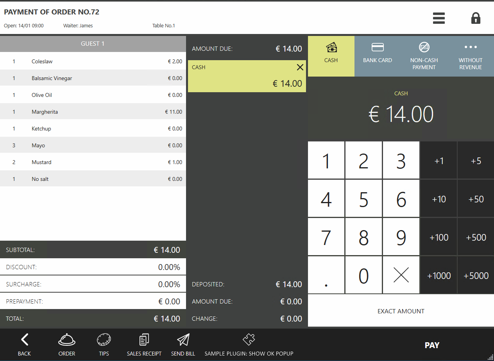
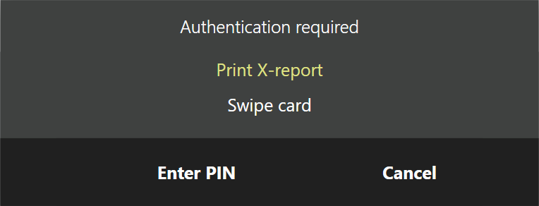

# Verification and request of permissions #

Actions that are run by the plugin may require checking or requesting permissions. To check user permissions, there are [`CheckPermission`](https://syrve.github.io/front.api.sdk/v7/html/M_Resto_Front_Api_IOperationService_CheckPermission.htm) and [`CheckPermissions`](https://syrve.github.io/front.api.sdk/v7/html/M_Resto_Front_Api_IOperationService_CheckPermissions.htm) methods. To request permissions, it is possible to show dialogs using  [`ShowCheckPermissionPopup`](https://syrve.github.io/front.api.sdk/v7/html/M_Resto_Front_Api_UI_IViewManager_ShowCheckPermissionPopup.htm) and [`ShowCheckPermissionsPopup`](https://syrve.github.io/front.api.sdk/v7/html/M_Resto_Front_Api_UI_IViewManager_ShowCheckPermissionsPopup.htm)methods  methods. The current user could be known using the [`GetCurrentUser`](https://syrve.github.io/front.api.sdk/v7/html/M_Resto_Front_Api_IOperationService_GetCurrentUser.htm)method. If the terminal is running in "Strict compliance with the schedule" mode, the current role can be found out using the [`GetStrictAccordanceToScheduleUserRole`](https://syrve.github.io/front.api.sdk/v7/html/M_Resto_Front_Api_IOperationService_GetStrictAccordanceToScheduleUserRole.htm) method.

## How does it look in Syrve POS?

For example, the plugin adds the *«SamplePlugin: Show OK popup»* button to the. Example realization could be seen in the SamplePlugin SDK project in the `ButtonsTester` class.



Let the button be clickable only by users with specific permissions. There are several ways to do this. To begin with, let's register the button:

```cs
// Registering the action on the cash screen
subscription = PluginContext.Operations.AddButtonToPaymentScreen(
``` 

As a result of running the registration method, it is possible to get the identifier of the button - `subscription.buttonId`. This identifier will be used in the following.

### Option 1: Disabling the button for all users who do not have the permission to press it.

It is possible to turn on and off a previously added button on the cash screen using the [`UpdatePaymentScreenButtonState`](https://syrve.github.io/front.api.sdk/v7/html/M_Resto_Front_Api_IOperationService_UpdatePaymentScreenButtonState.htm) method by passing the *isEnabled* parameter. Most convenient here would be to use the [`CurrentUserChanged`](https://syrve.github.io/front.api.sdk/v7/html/P_Resto_Front_Api_INotificationService_CurrentUserChanged.htm) event to know which user is working at the moment. Subscribe to the event and check whether the user has the permission (e.g., the right to print X report "F_XR"):

```cs
// Subscribing to a change event for the current user
PluginContext.Notifications.CurrentUserChanged.Where(user => user != null).DistinctUntilChanged().Subscribe(user =>
{
    var isButtonEnabled = PluginContext.Operations.CheckPermission(user, "F_XR");
    PluginContext.Operations.UpdatePaymentScreenButtonState(subscription.buttonId, isEnabled: isButtonEnabled);
});

``` 

This way, if the current user changes, the button will be turned off or on, depending on whether the right "F_XR" is present. [`CheckPermission`](https://syrve.github.io/front.api.sdk/v7/html/M_Resto_Front_Api_IOperationService_CheckPermission.htm) method takes 3 arguments as input:

- [`IUser`](https://syrve.github.io/front.api.sdk/v7/html/T_Resto_Front_Api_Data_Security_IUser.htm) `user` — the user for which the right is checked.
- `string permissionCode` — permission that the user must have. 
- [`IRole`](https://syrve.github.io/front.api.sdk/v7/html/T_Resto_Front_Api_Data_Security_IRole.htm) `role` — optional parameter. User permission. Used if the terminal works in "Strict adherence to schedule" mode, it can be obtained using the [`GetStrictAccordanceToScheduleUserRole`](https://syrve.github.io/front.api.sdk/v7/html/M_Resto_Front_Api_IOperationService_GetStrictAccordanceToScheduleUserRole.htm) method.

Similarly, it is possible to check several permissions using the [`CheckPermissions`](https://syrve.github.io/front.api.sdk/v7/html/M_Resto_Front_Api_IOperationService_CheckPermissions.htm)method. It takes 4 arguments as input:

- [`IUser`](https://syrve.github.io/front.api.sdk/v7/html/T_Resto_Front_Api_Data_Security_IUser.htm) `user` — the user for which the right is checked.
- `string[] permissionCodes` — permissions, which are checked in the user.
- [`PermissionsCheckMode`](https://syrve.github.io/front.api.sdk/v7/html/T_Resto_Front_Api_PermissionsCheckMode.htm) `checkMode` — check for all permissions (`PermissionsCheckMode.All`), or at least one (`PermissionsCheckMode.Any`).
- [`IRole`](https://syrve.github.io/front.api.sdk/v7/html/T_Resto_Front_Api_Data_Security_IRole.htm) `role` — optional parameter. User permission. Used if the terminal works in "Strict adherence to schedule" mode.

The list of permissions a user has may be changed. To keep track of that, it is possible to subscribe to the [`UserChanged`](https://syrve.github.io/front.api.sdk/v7/html/P_Resto_Front_Api_INotificationService_UserChanged.htm) event.

### Option 2: Hiding the button for all users who don't have the permission to click it.

It is possible to move the button registration to the [`CurrentUserChanged`](https://syrve.github.io/front.api.sdk/v7/html/P_Resto_Front_Api_INotificationService_CurrentUserChanged.htm) subscription:

```cs
(Guid buttonId, IDisposable buttonRegistration)? subscription = null;
// Subscribing to a change event for the current user
PluginContext.Notifications.CurrentUserChanged.Where(user => user != null).DistinctUntilChanged().Subscribe(user =>
{
    if (PluginContext.Operations.CheckPermission(user, "F_XR")) //The user has the permission
    {
        if (subscription == null) //Was the button previously created
            subscription = PluginContext.Operations.AddButtonToPaymentScreen("SamplePlugin: Show ok popup", false, true, ShowOkPopupOnPaymentScreen);
    }
    else //The user does not have the permission
    {
        subscription?.buttonRegistration.Dispose(); //Remove the button if it was created
        subscription = null;
    }
});
``` 

In this case, if the user does not have the permission, the button will not display.

### Option 3: To check if an operation can be run at the moment the button is pressed.

If it is possible to use an [`IViewManager`](https://syrve.github.io/front.api.sdk/v7/html/T_Resto_Front_Api_UI_IViewManager.htm) object, it is possible to show the permissions request window. For example, it can be accessed in subscription to a button click event. There can be a few variants of realization here.

#### Option 3.1: If the user has the permission, the request window will not be displayed. If the user does not have it, the right request window will be shown.

```cs
private void ShowOkPopupOnPaymentScreen((IOrder order, IOperationService os, IViewManager vm, (Guid buttonId, string caption, bool isChecked, string iconGeometry) state) info)
{
    if (info.vm.ShowCheckPermissionPopup("F_XR", false) == null) //The permission was not confirmed
        return;
    info.vm.ShowOkPopup("Test window", "Message shown using SamplePlugin.");
}
```

The [`ShowCheckPermissionPopup`](https://syrve.github.io/front.api.sdk/v7/html/M_Resto_Front_Api_UI_IViewManager_ShowCheckPermissionPopup.htm) method takes 2 arguments:

- `string permissionCode` —  the permission that the current user must have.
- `bool showConfirmPopupAnyway` — if `false`he window will be displayed only if the current user has no permission. If `true`, the window will be displayed even if the user has the permission.

The method returns an instance of [`IUser`](https://syrve.github.io/front.api.sdk/v7/html/T_Resto_Front_Api_Data_Security_IUser.htm) — the user who confirmed the permission, or `null` if the permission was not confirmed. Notice that any user, not only the one who is currently logged in to the terminal, can confirm the permission. 

In that case, if the current user has the permission, the permissions request window will not be displayed, and the operation will be run. If he does not have permission, then the window of permission request will be displayed:



If the permission has been confirmed, the [`ShowCheckPermissionPopup`](https://syrve.github.io/front.api.sdk/v7/html/M_Resto_Front_Api_UI_IViewManager_ShowCheckPermissionPopup.htm) method will return an instance  of [`IUser`](https://syrve.github.io/front.api.sdk/v7/html/T_Resto_Front_Api_Data_Security_IUser.htm) — the user who confirmed the permissions.

#### Option 3.2: Request the permission in any case, even if the user has it.

Sometimes unintentional execution of an operation can produce undesirable results. For that, it is possible to require confirmation of the permission, even if the current user already has it. Change the button-click subscriptions by sending `true` to `showConfirmPopupAnyway`:

```cs
private void ShowOkPopupOnPaymentScreen((IOrder order, IOperationService os, IViewManager vm, (Guid buttonId, string caption, bool isChecked, string iconGeometry) state) info)
{
    if (info.vm.ShowCheckPermissionPopup("F_XR", true) == null) //The permission was not confirmed
        return;
    info.vm.ShowOkPopup("Test window", "Message shown using SamplePlugin.");
}
```

In that case, the permissions request window will always be displayed.

### Option 4: Checking several rights.

It is possible to show the window for checking a few permissions, for example:

```cs
private void ShowOkPopupOnPaymentScreen((IOrder order, IOperationService os, IViewManager vm, (Guid buttonId, string caption, bool isChecked, string iconGeometry) state) info)
{
    if (info.vm.ShowCheckPermissionsPopup(new string[] { "F_XR", "F_ZREP" }, false, PermissionsCheckMode.Any) == null) //The permission was not confirmed
        return;
    info.vm.ShowOkPopup("Test window", "Message shown using SamplePlugin.");
}
```

The [`ShowCheckPermissionsPopup`](https://syrve.github.io/front.api.sdk/v7/html/M_Resto_Front_Api_UI_IViewManager_ShowCheckPermissionsPopup.htm) method takes 3 arguments:

- `string[] permissionCodes` — permissions, which are checked in the user.
- `bool showConfirmPopupAnyway` —  if `false`, the window will be displayed only if the current user has no permission. If `true`, the window will be displayed even if the user has the permission.
- [`PermissionsCheckMode`](https://syrve.github.io/front.api.sdk/v7/html/T_Resto_Front_Api_PermissionsCheckMode.htm) `checkMode` — check for all permissions (`PermissionsCheckMode.All`), or at least one  (`PermissionsCheckMode.Any`).

The method returns an object of [`IUser`](https://syrve.github.io/front.api.sdk/v7/html/T_Resto_Front_Api_Data_Security_IUser.htm) —  the user who confirmed the permission, or null if the permission was not confirmed.