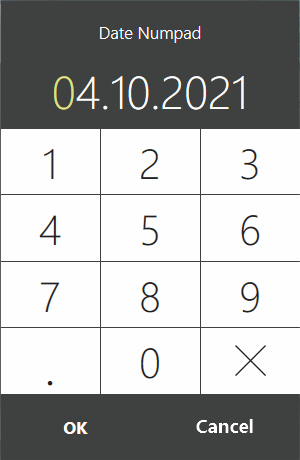

# Date and time request windows #

While the plugin is running, it may be needed to require the user to request the date and time. For this, the dialog windows can be shown using [`IViewManager.ShowDateNumpadPopup`](https://syrve.github.io/front.api.sdk/v7/html/M_Resto_Front_Api_UI_IViewManager_ShowDateNumpadPopup.htm), [`IViewManager.ShowDateTimePopup`](https://syrve.github.io/front.api.sdk/v7/html/M_Resto_Front_Api_UI_IViewManager_ShowDateTimePopup.htm) and [`IViewManager.ShowCalendarPopup`](https://syrve.github.io/front.api.sdk/v7/html/M_Resto_Front_Api_UI_IViewManager_ShowCalendarPopup.htm).

## How does it look in Syrve POS?

In some cases, an instance of the [`IViewManager`](https://syrve.github.io/front.api.sdk/v7/html/T_Resto_Front_Api_UI_IViewManager.htm) class is available to the plugin. It is available, for example, during the processing of a button click:

```cs
PluginContext.Operations.AddButtonToPluginsMenu("Sample Plugin", x =>
{
    var viewManager = x.vm;
});
```

or the triggering of some events:

```cs
PluginContext.Notifications.BeforeOrderBill.Subscribe(x =>
{
	var viewManager = x.vm;
});
```

For more details about this class, see the article «[Dialog windows]({{ site.baseurl }}/v6/en/ViewManager.html)». In these cases, the [`IViewManager`](https://syrve.github.io/front.api.sdk/v7/html/T_Resto_Front_Api_UI_IViewManager.htm) can be used to show dialog windows. Consider all methods for requesting the date and time from a user. As an example, create a button using the [`IOperationService.AddButtonToPluginsMenu`](https://syrve.github.io/front.api.sdk/v7/html/M_Resto_Front_Api_IOperationService_AddButtonToPluginsMenu.htm)method, as shown above, and show dialogs when it is clicked.

### Option 1: Date Numpad Popup

A simple dialog with the number keypad can be used to request a date only:

```cs
{
    var dateNumpadPopupResult = x.vm.ShowDateNumpadPopup(DateTime.Today, "Date Numpad");
});
```

This way, when you click on the button, the date selection window will be shown



Method [`IViewManager.ShowDateNumpadPopup(DateTime selectedDate, string title)`](https://syrve.github.io/front.api.sdk/v7/html/M_Resto_Front_Api_UI_IViewManager_ShowDateNumpadPopup.htm) accepts 2 arguments:

- `DateTime selectedDate` — date that will be selected when the window is displayed.
- `string title` — window title

The method will return the date selected by the user if he presses *«OK»*, or `null`,  if he presses *«Cancel»*.

### Option 2: Date-Time Popup

A date and time can be requested through a dialog:

```cs
PluginContext.Operations.AddButtonToPluginsMenu("Sample Plugin", x =>
{
    var dateTimePopupResult = x.vm.ShowDateTimePopup(DateTime.Now, "Date-Time", DateTime.Today, DateTime.Today.AddMonths(6));
});
```

ПриPressing the button will display the date and time selection window:


By clicking on the current date, the calendar is shown, with which a quick switch to another day can be made:


The method [`IViewManager.ShowDateTimePopup(DateTime selectedDate, [CanBeNull] string title, DateTime minDate, DateTime maxDate)`](https://syrve.github.io/front.api.sdk/v7/html/M_Resto_Front_Api_UI_IViewManager_ShowDateTimePopup.htm) accepts 4 arguments:

- `DateTime selectedDate` — date and time that will be selected when the window is displayed.
- `string title` — window title.
- `DateTime minDate` — the minimum date and time that can be selected. The value also affects the calendar.
- `DateTime maxDate` — the maximum date and time that can be selected. The value also affects the calendar.

The method will return the date and time selected by the user if he presses *«OK»*, or `null` if he presses *«Cancel»*.

### Option 3: Calendar Popup

For selecting a date, it is possible to use the window with the calendar:

```cs
PluginContext.Operations.AddButtonToPluginsMenu("Sample Plugin", x =>
{
    var dateCalendarPopupResult = x.vm.ShowCalendarPopup(DateTime.Today, "Calendar", DateTime.Today, DateTime.Today.AddMonths(6));
});
```

By clicking on the button, the window will be shown:


The method [`IViewManager.ShowCalendarPopup(DateTime selectedDate, [CanBeNull] string title, DateTime minDate, DateTime maxDate)`](https://syrve.github.io/front.api.sdk/v7/html/M_Resto_Front_Api_UI_IViewManager_ShowCalendarPopup.htm) accepts 4 arguments for input:

- `DateTime selectedDate` — date that will be selected when the window is displayed.
- `string title` — window title.
- `DateTime minDate` — the minimum date that can be selected.
- `DateTime maxDate` — the maximum date that can be selected.

The method will return the date selected by the user if he presses *«OK»* or `null`,  if he presses *«Cancel»*.