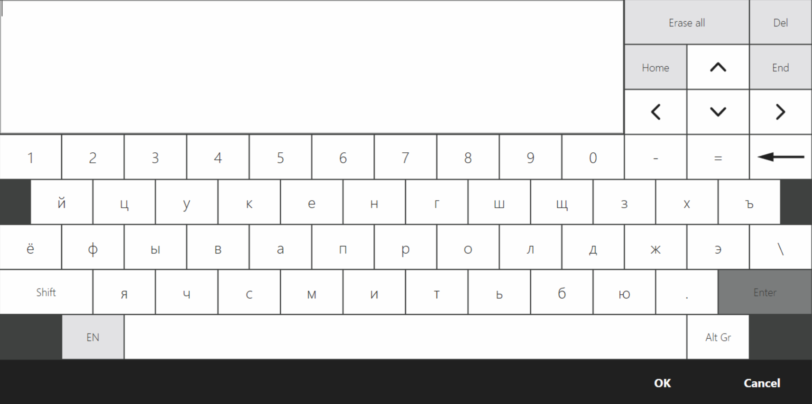

# Dialog for entering rows and barcodes #

Plugins can request data (rows, barcodes, cards) from the user using dialog windows. Here we will be looking at [`IViewManager.ShowExtendedKeyboardDialog`](https://syrve.github.io/front.api.sdk/v7/html/M_Resto_Front_Api_UI_IViewManager_ShowExtendedKeyboardDialog.htm), but there are also other dialogs, which you can read more about in the article [Dialogs]({{ site.baseurl }}/v6/en/ViewManager.html).

## How does it look in Syrve POS?

The Row Entry Dialog can be shown everywhere the [`IViewManager`](https://syrve.github.io/front.api.sdk/v7/html/T_Resto_Front_Api_UI_IViewManager.htm) is available. In [`Resto.Front.Api.SamplePlugin`](https://github.com/syrve/front.api.sdk/tree/master/sample/v7preview7/Resto.Front.Api.SamplePlugin) in the [`ButtonsTester`](https://github.com/syrve/front.api.sdk/blob/master/sample/v7preview7/Resto.Front.Api.SamplePlugin/ButtonsTester.cs) class there is an example of showing it by clicking the `SamplePlugin: Show extended keyboard view`:



In this article we will use that way: displaying the row input window when the button is clicked.

The dialog supports the following entry types:
- random row
- hidden row
- bar code reading
- card reading

The dialog accepts 8 parameters as input:
- `string title` - dialog title.
- `string initialText` - optional parameter. The line which will be entered when the dialog box is displayed. Defaults to `String.Empty`.
- `bool isMultiline` - optional parameter. Allows multi-line text to be entered. Ignored if the parameter `isPassword = true`. The default is `true`.
- `int maxLength` - Maximum line length. By default `Int32.MaxValue`.
- `bool capitalize` - optional parameter. Whether to write words automatically with a capital letter. Ignored if the `isPassword` parameter is true. The default is `false`.
- `bool isPassword` - optional parameter. Whether to hide the line when entering it. The default is `false`. Ignored if the `isMultiline` and `capitalize` parameters are `true`.
- `bool enableCardSlider` - optional parameter. Whether it is possible to enter data with a rolling card. Defaults to `false`.
- `bool enableBarcode` - optional parameter. Whether it is possible to enter data by reading a barcode. The default is `false`.

### Entering an arbitrary row

The `initialText`, `isMultiline` and `capitalize`.
parameters influence the input of an arbitrary string. For example, if we disallow multiline input, the entered line will start with a capital letter:

```cs
PluginContext.Operations.AddButtonToPluginsMenu("SamplePlugin: String input example", x =>
{
    var inputResult = x.vm.ShowExtendedKeyboardDialog("String input example", isMultiline: false, capitalize: true);
});
```

With these parameters, the dialog will respond only to keyboard input. Barcode scanning and card rolling will not be taken into. All words will be entered with a capital letter. This may be helpful when entering the first name, last name and middle name.

The result must be converted to [`StringInputDialogResult`](https://syrve.github.io/front.api.sdk/v7/html/T_Resto_Front_Api_Data_View_StringInputDialogResult.htm)type. Let's append the code:

```cs
PluginContext.Operations.AddButtonToPluginsMenu("SamplePlugin: String input example", x =>
{
    var inputResult = x.vm.ShowExtendedKeyboardDialog("String input example", isMultiline: false, capitalize: true);
    var strResult = inputResult as StringInputDialogResult;
    if (strResult == null)
        return; //The user clicked "Cancel"
    var result = strResult.Result; //User-entered text
});
```

### Entering a hidden row

You can hide the entered line with the parameter `isPassword`:

```cs
PluginContext.Operations.AddButtonToPluginsMenu("SamplePlugin: Password input example", x =>
{
    var inputResult = x.vm.ShowExtendedKeyboardDialog("Password input example", isPassword: true);
    var strResult = inputResult as StringInputDialogResult;
    if (strResult == null)
        return; //The user clicked "Cancel"
    var result = strResult.Result; //User-entered hidden text
});
```

As was written earlier, the `isMultiline` and `capitalize` parameters will not be considered. However, it remains possible to send `true` to the `enableCardSlider` and `enableBarcode`parameters, which will allow you to rolling the card and scanning the barcode.

### Card reading

The card reading can be tracked with the `enableCardSlider` parameter.The result will have to be of type [`CardInputDialogResult`](https://syrve.github.io/front.api.sdk/v7/html/T_Resto_Front_Api_Data_View_CardInputDialogResult.htm):

```cs
PluginContext.Operations.AddButtonToPluginsMenu("SamplePlugin: Card input example", x =>
{
    var inputResult = x.vm.ShowExtendedKeyboardDialog("Card input example", enableCardSlider: true);
    var cardResult = inputResult as CardInputDialogResult;
    if (cardResult == null)
        return; //The user clicked "Cancel" or it was another input type
    var result = cardResult.FullCardTrack; //Full info on the card
});
```

It is impossible to disable keyboard input in that case.

### Barcode scanning

Barcode scanning can be tracked with the `enableBarcode` parameter. In this way, the scanning of service barcodes will not be considered. The result has to be converted to type [`BarcodeInputDialogResult`](https://syrve.github.io/front.api.sdk/v7/html/T_Resto_Front_Api_Data_View_BarcodeInputDialogResult.htm):

```cs
PluginContext.Operations.AddButtonToPluginsMenu("SamplePlugin: Barcode input example", x =>
{
    var inputResult = x.vm.ShowExtendedKeyboardDialog("Barcode input example", enableBarcode: true);
    var barcodeResult = inputResult as BarcodeInputDialogResult;
    if (barcodeResult == null)
        return; //The user clicked "Cancel" or there was another input type
    var result = barcodeResult.Barcode; //Readed barcode
});
```

### Mixed input

Let our dialog work with text input, barcodes, and cards. Then we need to correctly process the result of input. `SamplePlugin` еhas an example of this way. Let's modify our code to support all input types:

```cs
PluginContext.Operations.AddButtonToPluginsMenu("SamplePlugin: Mixed input example", x =>
{
    var inputResult = x.vm.ShowExtendedKeyboardDialog("Mixed input example", enableCardSlider: true, enableBarcode: true);
    switch (inputResult)
    {
        case StringInputDialogResult stringInputDialogResult:
            var strResult = stringInputDialogResult.Result; //User-entered text
            return;
        case CardInputDialogResult cardInputDialogResult:
            var cardResult = cardInputDialogResult.FullCardTrack; //Full info on the card
            return;
        case BarcodeInputDialogResult barcodeInputDialogResult:
            var barcodeResult = barcodeInputDialogResult.Barcode; //Readed barcode
            return;
        default:
            return; //The user clicked "Cancel"
    }
});
```