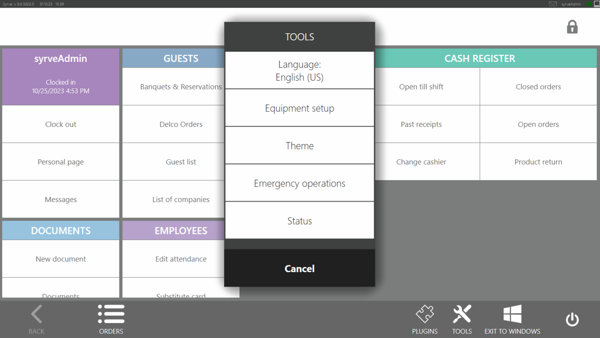

# Localization #

The user can set the language of the application. Starting with API V7, plugins whose logic depends on the terminal language have the possibility to work out the language change.

## How does it look in Syrve POS?

The language is changed in the settings screen:



Through the plugin, change the language of the terminal is impossible.

### How to know the current language

The current application language can be read using the [`IOperationService.GetHostTerminalSettings()`](https://syrve.github.io/front.api.sdk/v7/html/M_Resto_Front_Api_IOperationService_GetHostTerminalSettings.htm):

```cs
var settings = PluginContext.Operations.GetHostTerminalSettings();
```

The method returns an object that implements the [`IHostTerminalSettings`](https://syrve.github.io/front.api.sdk/v7/html/T_Resto_Front_Api_Data_Organization_IHostTerminalSettings.htm) interface. It includes two localization properties:
- `CultureInfo Culture` - language that is selected on the terminal.
- `CultureInfo UICulture` - has been added to the V7 API. The property now includes the same value as the `Culture` value. Later support for different cultures for data and the user interface is planned.

### Plugin startup settings

Starting with API V7, the plugin automatically gets the localization settings from the terminal when the application starts. Before the call of the plugin code, the properties are set:

- [`CultureInfo.CurrentCulture`](https://docs.microsoft.com/en-us/dotnet/api/system.globalization.cultureinfo.currentculture?view=net-6.0)
- [`CultureInfo.CurrentUICulture`](https://docs.microsoft.com/en-us/dotnet/api/system.globalization.cultureinfo.currentuiculture?view=net-6.0)
- [`CultureInfo.DefaultThreadCurrentCulture`](https://docs.microsoft.com/en-us/dotnet/api/system.globalization.cultureinfo.defaultthreadcurrentculture?view=net-6.0)
- [`CultureInfo.DefaultThreadCurrentUICulture`](https://docs.microsoft.com/en-us/dotnet/api/system.globalization.cultureinfo.defaultthreadcurrentuiculture?view=net-6.0)

They get the same values as the terminal. Currently, the `CurrentUICulture` property will have the same value as `CurrentCulture`, and `DefaultThreadCurrentUICulture` will have the same value as`DefaultThreadCurrentCulture`.

### Tracking language changes by the plugin

The user can change the language of the Syrve POS while it is running. This will cause the culture properties described above to be changed. However, automatically changing the values of these properties for the plugin code is a risky operation. For example, when the terminal language changes, the plugin may implement an operation, the result of which depends on the culture. So, for the situation when changing the language of the terminal while it is running, it was decided not to set these properties for plugins automatically. In API V7 added event [`INotificationService.CurrentCultureChanged`](https://syrve.github.io/front.api.sdk/v7/html/P_Resto_Front_Api_INotificationService_CurrentCultureChanged.htm), which allows to track the change of terminal language and set the plugin's culture at a convenient time. This event has 2 arguments:

- `CultureInfo culture` - the new culture.
- `CultureInfo uiCulture` - the same as `culture`.

For example, if the plugin code allows you to apply new settings instantly, the properties can be set right away:

```cs
PluginContext.Notifications.CurrentCultureChanged.Subscribe(x =>
{
    CultureInfo.CurrentCulture = x.culture;
    CultureInfo.CurrentUICulture = x.uiCulture; //Same as x.culture for now
    CultureInfo.DefaultThreadCurrentCulture = x.culture;
    CultureInfo.DefaultThreadCurrentUICulture = x.uiCulture; //Same as x.culture for now
});
```

### Returning to the start state

If the plugin shouldn't change the culture when the terminal starts, the code can be written in its constructor to return the culture to its original state:

```cs
public MyPlugin()
{
    //Sets the culture from the operating system settings
    CultureInfo.CurrentCulture = CultureInfo.InstalledUICulture;
    CultureInfo.DefaultThreadCurrentCulture = CultureInfo.InstalledUICulture;
    CultureInfo.CurrentUICulture = CultureInfo.InstalledUICulture;
    CultureInfo.DefaultThreadCurrentUICulture = CultureInfo.InstalledUICulture;
}
```