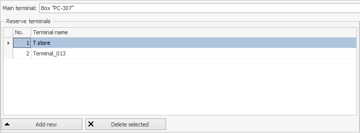

The V8Preview6 version introduces the possibility to control the state of the Main Terminal (MT) of a group and, if needed, to transfer this role to another terminal.

The innovation consists of the next elements:

1.	A list of reserve terminals;
2.	Tracking the status of the main terminal;
3.	Possibility to recustomize the main terminal via API.

More:

1) In the Syrve Office application in Store Settings => Group Settings it is possible to set up a list of reserve terminals. These terminals will be the spare terminals which can take over the role of the MT if needed. The form for set the reserve terminals is as follows:



In API, in the [`ITerminalsGroup`](https://syrve.github.io/front.api.sdk/v8/html/T_Resto_Front_Api_Data_Organization_ITerminalsGroup.htm ) interface, the [`StandbyTerminals`](https://syrve.github.io/front.api.sdk/v8/html/P_Resto_Front_Api_Data_Organization_ITerminalsGroup_StandbyTerminals.htm) list has been added, which contains the list of reserve terminals set in Syrve Office. To get information about the current group of terminals, it is possible to use the [`GetHostTerminalsGroup`](https://syrve.github.io/front.api.sdk/v8/html/M_Resto_Front_Api_IOperationService_GetHostTerminalsGroup.htm) method or subscribe to the [`TerminalsGroupChanged`](https://syrve.github.io/front.api.sdk/v8/html/P_Resto_Front_Api_INotificationService_TerminalsGroupChanged.htm).

2) Each a waiter or user workstations tracks the state of the connection to the MT and if the state has changed, the terminal will report it. For this purpose a new notification [`ConnectionToMainTerminalChanged`](https://syrve.github.io/front.api.sdk/v8/html/P_Resto_Front_Api_INotificationService_ConnectionToMainTerminalChanged.htm) was added. In this notification the connection state is transmitted: `true` - connection with the MT is established, `false` - connection with the MT is lost.

3) A new operation [`ChangeGroupMainTerminal`](https://syrve.github.io/front.api.sdk/v8/html/M_Resto_Front_Api_IOperationService_ChangeGroupMainTerminal.htm)was implemented in the API, which allows to change MT. To run this operation it is needed to have the permission to run dangerous operations ([`F_DOP`](https://en.syrve.help/articles/#!office-8-5/topic-745)) and to transfer as argument a terminal, which is a reserve terminal. After this operation, the transferred terminal will be as MT, and the previous MT will be moved to the list of reserve terminals.

Example:
```cs
private static void ChangeGroupMainTerminal(IOperationService os)
{
	var newMainTerminal = os.GetHostTerminalsGroup().StandbyTerminals.First();
	os.ChangeGroupMainTerminal(os.GetCredentials(),newMainTerminal);
}
```

At the moment, it is necessary to have license 21053302 in order to use this new feature. Also this license removes the 30-second delay when Syrve POS is rebooting.