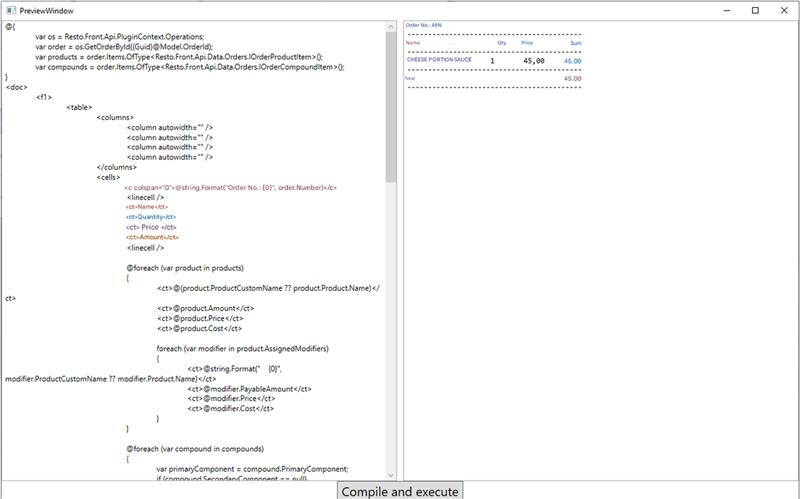

A new sample [`SampleRazorRunner`](https://github.com/syrve/front.api.sdk/tree/master/sample/v8/Resto.Front.Api.SampleRazorRunner) has been published, which demonstrates the possibilities of using Razor markup in combination with data obtained from Resto.Front.Api.

This example has a static class `RazorRunner`, which contains 2 methods `UpdateRazorAssemblyReference` and `RunCompile`.

1. `UpdateRazorAssemblyReference(string restoApiAssemblyToUse, params string[] otherAssembliesToUse)` - this method allows you to update the list of assemblies whose contents will be used to compile the Razor template.
	1. The first argument, restoApiAssemblyToUse, is required. The compiler needs to know which API version will be used.
	2. The second argument is optional. Additional assemblies should be specified if they contain any required data, methods, or models for the template that the compiler is not initially instructed to use. Several libraries will always be used, as they are necessary for the proper functioning of the compiler:
		
		- mscorlib.dll
		- netstandard.dll
		- System.dll
		- System.Core.dll
		- RazorEngine.NetStandard.dll
		- Microsoft.CSharp.dll 

	The method uses the `ExternalAssemblyReferenceResolver` class, which describes the process of updating assembly references for Razor.

2. `RunCompile(string template, object model)` - this method is directly responsible for compiling the Razor template..
	1. `template` - template in the form of a string. The string can be written dynamically or loaded from files. The typical extension for a Razor template is .cshtml.
	2. `model` - a model object with a given data set.
 
It is worth noting that models for templates can be of two types:
	
- Static - in this case, the `model` is passed to the compiler. You may also need to pass the name of the DLL containing the model to `UpdateRazorAssemblyReference` in `otherAssembliesToUse`.
- Dynamic - a dynamically created model is passed in the `model` field. For example: `new { OrderNumber = 27, OrderId = PluginContext.Operations.GetOrders().Last().Id }`. However, with this method of specifying data, the Razor template must include type declarations for all passed data: `(int)OrderNumber`, `(Guid)OrderId`.

The example also has a simple window:

It allows you to dynamically define a template and view the resulting output or error information. SampleRazorRunner comes with a sample Razor markup file, `RazorTemplateSample.cshtml`. This example displays some data about an order.

If you want to use this mechanism in your plugin, you can copy the RazorRunner.cs file and specify the `System.Runtime.CompilerServices.Unsafe` section in app.config.

When creating and using Razor templates for printing in Resto.Front.Api, it is worth knowing [`Markup Language`](https://en.syrve.help/articles/#!syrve-office-8-9/topic-5).

Below is a simple example of using this functionality:

    using RestoRazorRunner;
    using System;
    using System.Linq;
    using System.Xml.Linq;
    using Resto.Front.Api.Data.Print;
    
    namespace Resto.Front.Api.SamplePlugin
    {
    	public static class RazorRunnerSample
    	{
    		public static void RunCompileSample()
    		{
    			var os = PluginContext.Operations;
    
			    //Setting up a simple Razor template
			    var razorTemplate = "@{" +
			    "\r\nvar os = Resto.Front.Api.PluginContext.Operations;" +
			    "\r\nvar order = os.GetOrderById((Guid)@Model.OrderId);" +
			    "\r\n}" +
			    "\r\n<doc>" +
			    "\r\n@string.Format(\"Order \u2116: {0}\", order.Number)" +
			    "\r\n</doc>";
			    
			    var model = new SampleOrderModel { OrderId = os.GetOrders().Last().Id };
			    
			    //Specify which libraries need to be used.
			    RazorRunner.UpdateRazorAssemblyReference(
			    typeof(PluginContext).Assembly.ManifestModule.Name //Gets the current API version used by the plugin.
			    );
			    
			    //Getting the compiled template
			    var result = RazorRunner.RunCompile(razorTemplate, model);
			    
			    //Printing it using Resto.Front.Api
			    var printingDevice = os.GetPrintingDeviceInfos().Last();
			    os.Print(printingDevice, new Document { Markup = XElement.Parse(result) });			    
    		}
    
    		public sealed class SampleOrderModel
    		{
    			public Guid OrderId { set; get; }
    		}
    	}
    }

Alternatively, instead of printing, you can get fully formatted text using the [`FormatDocumentOnPrintingDevice`](https://syrve.github.io/front.api.sdk/v8/html/M_Resto_Front_Api_IOperationService_FormatDocumentOnPrintingDevice.htm) operation.