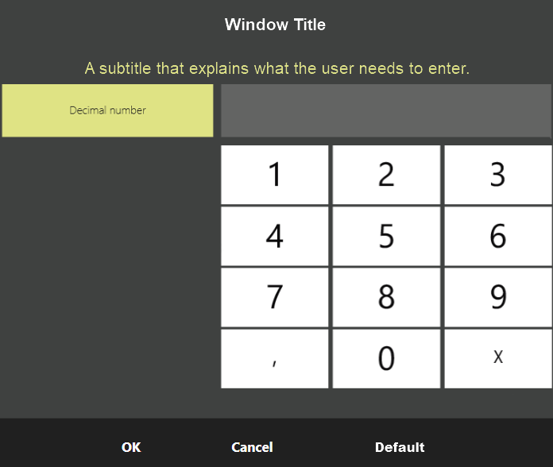

### Numeric strings entry dialog
Beginning with version V8, the structure of the settings class, [`ExtendedInputDialogSettings`](https://syrve.github.io/front.api.sdk/v8/html/T_Resto_Front_Api_UI_ExtendedInputDialogSettings.htm), has been changed and is transferred as a parameter to the [`Dialog window`](https://syrve.github.io/front.api.doc/v6/ru/ViewManager.html) - [`ShowExtendedInputDialog()`](https://syrve.github.io/front.api.sdk/v8/html/M_Resto_Front_Api_UI_IViewManager_ShowExtendedInputDialog.htm).

[`ExtendedInputDialogSettings.EnableNumericString`](https://syrve.github.io/front.api.sdk/v7/html/P_Resto_Front_Api_UI_ExtendedInputDialogSettings_EnableNumericString.htm) is replaced by [`NumericInputMode`](https://syrve.github.io/front.api.sdk/v8/html/T_Resto_Front_Api_UI_NumericInputMode.htm), which is an `enum` type that consists of:
- [`Disabled`](https://syrve.github.io/front.api.sdk/v8/html/T_Resto_Front_Api_UI_NumericInputMode.htm) - default value. Entering numeric values is not available.
- [`String`](https://syrve.github.io/front.api.sdk/v8/html/T_Resto_Front_Api_UI_NumericInputMode.htm) - input integer numbers.
- [`Decimal`](https://syrve.github.io/front.api.sdk/v8/html/T_Resto_Front_Api_UI_NumericInputMode.htm) - input fractional numbers.
 
For the input type of fractional numbers [`Decimal`](https://syrve.github.io/front.api.sdk/v8/html/T_Resto_Front_Api_UI_NumericInputMode.htm) properties have been added:
- [`MaxDecimalValue`](https://syrve.github.io/front.api.sdk/v8/html/P_Resto_Front_Api_UI_ExtendedInputDialogSettings_MaxDecimalValue.htm) - maximum value.
- [`MinDecimalValue`](https://syrve.github.io/front.api.sdk/v8/html/P_Resto_Front_Api_UI_ExtendedInputDialogSettings_MinDecimalValue.htm) - minimum value.
- [`DefaultDecimalValue`](https://syrve.github.io/front.api.sdk/v8/html/P_Resto_Front_Api_UI_ExtendedInputDialogSettings_DefaultDecimalValue.htm) - default value.

With the new properties, it is possible to set appropriate limits for fractional numbers.

When selecting `String` or `Decimal`, the user will be offered to enter integers or fractions. [`ExtendedInputDialogSettings.TabTitleNumericString`](https://syrve.github.io/front.api.sdk/v8/html/P_Resto_Front_Api_UI_ExtendedInputDialogSettings_TabTitleNumericString.htm) is used as explanatory text for fractional numbers.



Пример:
```cs
var settings = new ExtendedInputDialogSettings
{
    NumericInputMode = NumericInputMode.Decimal,
    TabTitleNumericString = "Decimal number",
    MaxDecimalValue = 500,
    DefaultDecimalValue = 50
}

var dialogResult = viewManager.ShowExtendedInputDialog(
                "Window Title", 
                "A subtitle explaining exactly what the user needs to enter.",
                settings) 
    as NumericStringInputDialogResult;
if (dialogResult == null)
    return;
// analyze result
```